# DashBite — living plan

The one plan file for the DashBite demo. The Architect owns it. Each new stage is **appended** as its own `## <Stage> — …` section; earlier sections are never overwritten wholesale.

**Product story:** food-delivery orders come in, and we predict whether each order will be late.

**Raw order fields:** `order_id`, `timestamp`, `distance_km`, `prep_minutes`, `order_value`, `was_late`

---

## Base — Pipeline diagram

```mermaid
flowchart LR
    %% ---------- stages (separate processes, each run via make) ----------
    SIM["Simulator<br/>make simulator"]
    PRE["Preprocess<br/>make preprocess"]
    TRAIN["Train<br/>make train"]
    INFER["Infer<br/>make infer"]
    DASH["Model Pulse dashboard<br/>make dashboard"]

    %% ---------- hand-off folders (the only coupling between stages) ----------
    RAW[("data/raw/<br/>order batches")]
    PROC[("data/processed/<br/>clean features")]
    MODELS[("data/models/<br/>model_v001, v002, …<br/>+ metadata")]
    PREDS[("data/predictions/<br/>late / on-time scores")]

    %% ---------- main flow ----------
    SIM -->|"writes orders"| RAW
    RAW -->|"reads"| PRE
    PRE -->|"writes features"| PROC
    PROC -->|"reads labeled history"| TRAIN
    TRAIN ==>|"WRITE PATH:<br/>publishes new versioned checkpoint"| MODELS
    MODELS ==>|"READ PATH:<br/>loads newest checkpoint on disk"| INFER
    PROC -->|"reads new orders"| INFER
    INFER -->|"writes predictions"| PREDS

    %% ---------- dashboard only reads existing outputs ----------
    RAW -.->|"sample volume over time"| DASH
    MODELS -.->|"model versions + metrics"| DASH
    PREDS -.->|"predicted vs. actual lateness"| DASH

    classDef stage fill:#e8f0fe,stroke:#3b6fd8,color:#111
    classDef store fill:#fff4e0,stroke:#d08a1a,color:#111
    classDef viz fill:#e9f7ef,stroke:#2e8b57,color:#111
    class SIM,PRE,TRAIN,INFER stage
    class RAW,PROC,MODELS,PREDS store
    class DASH viz
```



**How to read it:** blue boxes are stages (separate processes, each started by a `make` target); orange cylinders are folders under `data/` — the only way stages talk to each other. Thick arrows are the model write path (train → `data/models/`) and read path (`data/models/` → infer). Dotted arrows are read-only: Model Pulse reads what's already on disk and owns no pipeline logic. `make run` / `make stop` start and stop the whole chain; `make clean-data` resets `data/`.

### Teaching beats (repeat these as we build)

- **The Makefile is the interface.** Everything in class and in smoke tests runs through `make …`. Stages are implemented as `python -m pipeline.<stage>`, but nobody types that — if something has no make target, we add one.
- **Folders are contracts, imports are not.** Stages never import each other; they agree only on what lives in `data/raw/`, `data/processed/`, `data/models/`, and `data/predictions/`.
- **Train publishes, infer consumes.** Training writes a new, never-overwritten version (`model_v001`, `v002`, …). Inference picks up the newest checkpoint on disk.
- **Failure is isolated.** If training is down, inference keeps serving the last good model. Kill a stage in the demo to prove it.
- **Dashboards read; they don't compute the pipeline.** Model Pulse only reads existing outputs.
- **Claim-first viz.** Chart titles state the finding (e.g. "Late orders rise past 8 km"), labels are human-readable, one story per chart. Model Pulse always includes sample volume *over time*, not just a single count.
- **Boring tech on purpose.** Plain Python and files — no containers, Kafka, or Spark. The ideas are the architecture, not the tooling.
- **One living plan.** `docs/plan.md` grows stage by stage; Manual Smoke Tests are written as `make …` commands.

---

## Stage 1 — Foundation: config, data paths, test harness

### Goal
Give every later stage one shared place to read settings and find its hand-off folders, plus a pytest harness and a Makefile to drive it all. There is no pipeline logic yet. At the end of this stage, the room can see the config and watch `data/` get created with one `make` command.

**Starting point (inspected):** the repo contains only `docs/plan.md`. There is no code, no Makefile and no `data/`. The local interpreter is Python 3.9.6, so code must stay 3.9-compatible (no `match`; use `from __future__ import annotations` for `X | None` hints).

### Proposed changes
- **`Makefile`** is the public interface. Targets for this stage:
  - `make install` creates `.venv/` and installs `requirements.txt`.
  - `make test` runs all tests. `make test-unit`, `make test-regression` and `make test-integration` run one marker each.
  - `make config` runs `python -m pipeline.config`, which prints the resolved config and creates or confirms the data dirs.
  - `make clean-data` removes `<project root>/data/` only and never touches code or `docs/`. If `DASHBITE_DATA_DIR` is set, it refuses and exits non-zero rather than deleting a folder it doesn't own. Delete a custom data dir by hand.
  - All targets call `.venv/bin/python`, so the room never has to activate the venv.
  - The Makefile refuses to run at all if the project path contains a space. Make splits paths on spaces, and `clean-data`'s `rm -rf` would otherwise hit a parent folder.
- **`requirements.txt`** contains `pytest` only. Later stages add their own dependencies here.
- **`pipeline/__init__.py`** is an empty package marker.
- **`pipeline/config.py`**:
  - `Config` is a frozen dataclass with `train_every_n_events: int = 2000`, `batch_size: int = 50` and `data_dir: Path = <project root>/data`. The project root is the `DashByte-Demo/` folder holding `pipeline/`, not the git root or the shell's cwd.
  - `load_config(env=None) -> Config` reads `TRAIN_EVERY_N_EVENTS`, `BATCH_SIZE` and `DASHBITE_DATA_DIR` from `os.environ`, or from an injected dict for tests. Anything not set keeps its default.
  - Surrounding whitespace is stripped. `DASHBITE_DATA_DIR` expands `~`, and a relative value resolves from the project root.
  - Bad values raise `ValueError` with the variable name in the message: an int that isn't an integer or is ≤ 0, or an empty `DASHBITE_DATA_DIR`. There is no silent fallback. The CLI prints `config error: …` to stderr and exits 1.
  - `python -m pipeline.config` prints one `key = value` line per setting, then calls `ensure_data_dirs()` and prints each dir as `created` or `exists`.
- **`pipeline/paths.py`**:
  - `raw_dir(cfg)`, `features_dir(cfg)`, `models_dir(cfg)`, `predictions_dir(cfg)` and `quality_dir(cfg)` return paths under `cfg.data_dir` without touching the disk.
  - `ensure_data_dirs(cfg) -> dict[str, tuple[Path, bool]]` runs `mkdir(parents=True, exist_ok=True)` on all five and reports which ones it newly created. It is safe to run repeatedly.
- **`pytest.ini`** sets `testpaths = tests`, registers the `unit`, `regression` and `integration` markers, and uses `--strict-markers` so a typo in a marker fails the run.
- **`tests/`**:
  - Tests are split into `unit/`, `regression/` and `integration/`. `integration/test_makefile.py` drives the real Makefile. It only ever runs `clean-data` as `make -n` (dry run), so tests can't delete the real `data/`.
  - `conftest.py` provides a `tmp_data_dir` fixture that points `DASHBITE_DATA_DIR` at `tmp_path`, so tests never write to the real `data/`.
- **`.gitignore`** covers `.venv/`, `data/`, `__pycache__/` and `.pytest_cache/`.
- **Plan note:** the folder names are now fixed as `data/raw`, `data/features`, `data/models`, `data/predictions` and `data/quality`.
  - `data/features/` is the folder the Base diagram calls `data/processed/`.
  - `data/quality/` is new. It is reserved for data-quality reports from a later stage.

### Architecture / boundaries
- Config and paths are the only shared code. Stages still never import each other, only `pipeline.config` and `pipeline.paths`.
- Environment variables override defaults, and nothing else does. There are no config files or CLI flags in this stage. Each run re-reads the environment, so `VAR=… make <target>` is always the way to override.
- Path helpers are pure: they return paths without side effects. Only `ensure_data_dirs()` writes to disk, and it only creates directories.
- Everything resolves from `data_dir`, and that path comes from the project root rather than the current working directory. This lets `make` and the tests run from any directory.
- Plain Python standard library only (`dataclasses`, `os`, `pathlib`). `pytest` is the only third-party package.

### Automated tests
Gate: `make test` (green before we move on).
- **Unit (`-m unit`):**
  - `load_config({})` returns the defaults 2000, 50 and `<project root>/data`.
  - Each env var overrides its field, and the `"500"` string becomes the integer `500`. Surrounding whitespace is tolerated.
  - `"abc"`, `"0"`, `"-5"`, `""` and `"2.5"` each raise a `ValueError` that names the variable. So does a blank `DASHBITE_DATA_DIR`.
  - Zero and negative counts (`"0"`, `"-0"`, `"-1"`, `"-2000"`, `" -5 "`) give exactly `<VAR> must be a positive integer, got '<value>'` for both `TRAIN_EVERY_N_EVENTS` and `BATCH_SIZE`.
  - `DASHBITE_DATA_DIR` accepts absolute paths, relative paths (resolved from the project root) and `~` paths.
  - Each path helper returns `data_dir / <name>` and creates nothing on disk.
  - `ensure_data_dirs` creates only the missing dirs and agrees with the helpers. It raises if a dir name is already taken by a file.
- **Regression (`-m regression`):**
  - The defaults stay pinned at `TRAIN_EVERY_N_EVENTS == 2000` and `BATCH_SIZE == 50`.
  - The set of data-dir names stays exactly `{raw, features, models, predictions, quality}`.
  - The env var names stay exactly `TRAIN_EVERY_N_EVENTS`, `BATCH_SIZE` and `DASHBITE_DATA_DIR`.
  - These are contracts that later stages (and `VAR=… make`) depend on, so changing one should need a deliberate test update.
- **Integration (`-m integration`):**
  - Run `python -m pipeline.config` as a subprocess from an unrelated cwd with `DASHBITE_DATA_DIR=<tmp>` and `BATCH_SIZE=25`.
  - Assert exit code 0, that the output shows `batch_size = 25`, and that all five dirs exist on disk and report `created`.
  - Run it a second time and assert every dir reports `exists` (idempotent).
  - A bad `BATCH_SIZE` or `TRAIN_EVERY_N_EVENTS` exits non-zero, names the variable with no traceback, and creates nothing.
  - Setting either one to `0` or `-3` makes `python -m pipeline.config` exit 1. It prints exactly `config error: <VAR> must be a positive integer, got '<value>'` to stderr, prints nothing to stdout, and creates no dirs.
  - `make -f <Makefile> config` from another cwd honours all three env overrides, and a bad value fails `make`.
  - `make -n clean-data` targets only `<project root>/data`, and refuses when `DASHBITE_DATA_DIR` is set.
  - A copy of the Makefile in a folder with a space in its path refuses to run, both from inside it and via `make -f`.

### Manual Smoke Test
#### What we're proving
One command loads the config, environment variables override it live, and the five hand-off folders appear under `data/` and are safe to create again.

#### Terminal
```bash
make install
```
```bash
make clean-data
```
```bash
make config
```
```bash
ls data/
```
```bash
BATCH_SIZE=10 TRAIN_EVERY_N_EVENTS=500 make config
```
```bash
BATCH_SIZE=oops make config
```

#### Watch for
- The first `make config` prints `train_every_n_events = 2000` and `batch_size = 50`, and all five dirs show **created**.
- `ls data/` lists `features  models  predictions  quality  raw`.
- The override run prints `500` and `10`, and every dir now shows **exists**. Nothing is recreated.
- `BATCH_SIZE=oops` fails loudly with an error that names `BATCH_SIZE`, and make exits non-zero. Bad config should never pass silently.
- If your shell has `DASHBITE_DATA_DIR` exported, `make clean-data` refuses on purpose. Run `unset DASHBITE_DATA_DIR` first.

#### Stop
Nothing to stop. Every command exits on its own. Run `make clean-data` to reset.

---

## Stage 2 — Order simulator: synthetic orders land in `data/raw/`

### Goal
Make the system feel alive. A long-running simulator writes a new CSV batch of DashBite orders into `data/raw/` every few seconds and logs each arrival. Some rows are deliberately messy so a later preprocess stage has real cleaning to do. Nothing reads these files yet. This stage also adds `make run` / `make stop`, which start and stop the pipeline's long-running processes in the background. For now that's just the simulator.

**Starting point (inspected):** Stage 1 is in place:
- `pipeline/config.py` provides `Config` and `load_config()`.
- `pipeline/paths.py` provides `raw_dir()` and `ensure_data_dirs()`.
- The Makefile has `install`, `test*`, `config` and `clean-data`. There is no `pipeline/simulator.py` and no `simulator` target yet.

**Status (as built):** implemented, and `make test` is green with 141 tests (120 at landing, 7 added in the Stage 2 review, and 14 Stage 1 zero/negative config tests added later). The sections below describe the code as it actually landed, including where the Implementer departed from the original plan. Those departures are marked *(changed from plan)*.

### Proposed changes
- **`pipeline/simulator.py`** (new). It is runnable as `python -m pipeline.simulator`.
  - `COLUMNS` holds the six column names in order, `FILE_GLOB = "orders_*.csv"` is the pattern downstream stages match, and `batch_filename(now, seq)` builds each file's name.
  - `generate_batch(rng, n, now, messy_rate=0.05, *, span_seconds=3.0, noise_sd=4.0, late_threshold=30.0) -> list[dict[str, str]]` returns `n` rows of strings, exactly as they'll appear in the CSV, with the columns `order_id, timestamp, distance_km, prep_minutes, order_value, was_late`. The three keyword-only arguments *(changed from plan)* let `run()` and the tests control the time spread, noise and threshold.
    - `order_id` is `ORD-` followed by 10 hex characters drawn from `rng`. It is unique within a batch, and collisions across runs are practically impossible.
    - `timestamp` is ISO-8601 UTC (`YYYY-MM-DDTHH:MM:SSZ`), spread evenly across the `span_seconds` before `now` and ending at `now`. `run()` passes the interval as the span. This gives the dashboard's volume-over-time chart real timestamps.
    - `to_utc(moment)` is the one place times get normalised: a naive time is treated as UTC, and an aware one is converted. File names and row timestamps both go through it, so they always agree.
    - The value ranges are as planned. The shapes are realistic rather than uniform *(changed from plan)*:
      - `distance_km` runs from 0.5 to 15 with one decimal. It's log-normal with a median of about 4 km, clamped to the range, so most orders are local.
      - `prep_minutes` is an integer from 5 to 30, most often around 12.
      - `order_value` runs from 8 to 120 with two decimals, most often around 28.
    - `was_late` is `0` or `1` from one readable rule, `is_late(prep, distance, noise, threshold)`: estimated delivery = `prep_minutes + 3 × distance_km + noise`, where noise is normal with a 4-minute standard deviation. The order is late if that exceeds the threshold.
      - **The threshold defaults to 30 minutes** *(changed from plan's 35; **approved by the Architect**, 2026-09-28)*, and `SIM_LATE_THRESHOLD_MINUTES` overrides it.
      - At 30 minutes, about **44%** of orders are late, not the planned 25–35%. At the original 35 minutes, the same order mix gives about 28%.
  - **Messy rows.** Each row has a `messy_rate` chance (default 0.05) of getting one defect. The defects are:

    | Defect | Column | Exact value written (always this, never a variant) |
    |---|---|---|
    | `blank` | `order_value` | empty string (the CSV shows `,,`) |
    | `negative_distance` | `distance_km` | `-1.0` |
    | `missing_prep` | `prep_minutes` | `n/a` |
    | `text_label` | `was_late` | `yes` |
    | `outlier_distance` | `distance_km` | `999.0` |
    | `duplicate_id` | `order_id` | the `order_id` of an earlier row in the same batch, so the row count stays `n` |

    These six values live in one `MESSY_DEFECTS` mapping (`name → (column, value)`) in `pipeline/simulator.py`. The tests and the later preprocess stage import that mapping instead of retyping the values. The smoke-test `grep` below matches these exact values.
    - `duplicate_id` has no fixed value, so its entry holds the placeholder `COPY_EARLIER_ID`. The first row in a batch never gets it, because there's no earlier row to copy.
    - `find_defect(row, earlier_ids)` names a row's defect, or returns `None` if the row is clean. `count_messy(rows)` counts them for the log line.

    Messy rows are left for later cleaning; the simulator never fixes them.
  - `write_batch(rows, out_dir, now, seq) -> Path` writes `orders_<YYYYmmddTHHMMSSZ>_<seq:04d>.csv` with a header row.
    - It writes to a hidden `.orders_….csv.tmp` file first, then renames it with `os.replace`, so a reader never sees half a file. If the write fails, the `.tmp` file is removed.
    - It refuses to overwrite an existing file.
  - `run(cfg, interval, max_batches=None, seed=None, messy_rate=0.05) -> (batches, orders)` does the following:
    - Calls `ensure_data_dirs(cfg)`.
    - Loops `generate_batch` → `write_batch` → log line → sleep.
    - Batch numbers start at `0001` each run. If that name is already taken, because a previous run wrote a batch in the same second, `run()` steps to the next free number instead of crashing *(fixed in review)*. Names stay unique and still sort in time order.
    - Logs each batch with flushed stdout, like this:
      `[simulator 14:02:03] new orders arrived: 20 (1 messy) → data/raw/orders_20260928T140203Z_0003.csv | total 60`
    - On Ctrl+C (`KeyboardInterrupt`), prints `[simulator] stopped after N batches, M orders` and exits 0 without leaving a `.tmp` file behind.
    - SIGTERM gets the same clean shutdown: a handler turns it into `KeyboardInterrupt`. That's how `make stop` stops it.
  - `main()` loads config and installs the SIGTERM handler. It prints a one-line startup banner, then calls `run`. A config error prints `config error: …` and exits 1, the same as in Stage 1.
    - Banner: `[simulator] batch size 20, every 3s, messy rate 5%, late after 30 min → writing to data/raw (Ctrl+C to stop)`.
    - When `SIM_MAX_BATCHES` or `SIM_SEED` is set, the banner adds `up to N batches` or `seed N`.
- **`pipeline/config.py`**: add simulator and runner settings, still environment-only and read by `load_config()`. Each becomes a `Config` field.
  - `SIM_INTERVAL_SECONDS` is a positive float, default `3.0`.
  - `SIM_MAX_BATCHES` is a positive int. Unset means run forever; tests and quick demos set it.
  - `SIM_SEED` is an int. Unset means a random seed each run.
  - `SIM_MESSY_RATE` is a float from 0 to 1 inclusive, default `0.05`.
  - `SIM_LATE_THRESHOLD_MINUTES` is a positive float, default `30.0` *(new, not in the original plan)*. It sets the lateness cutoff in the simulator's rule.
  - `DASHBITE_RUN_DIR` is a path, default the project root. It sets where `.run/` and `logs/` go, and resolves like `DASHBITE_DATA_DIR`: surrounding spaces are stripped, `~` is expanded, relative paths resolve from the project root, and blank is an error.
  - `ENV_VARS` *(new)* is a tuple of all nine variable names `load_config()` reads. Tests strip every one of them so a developer's shell settings can't leak in.
  - `load_run_dir()` *(new)* resolves only `DASHBITE_RUN_DIR`. That way `make stop` still works if some other variable is set to a bad value.
  - Batch size reuses `BATCH_SIZE`, so there are no new sizing knobs. **Its default changes from 50 to 20** in `pipeline/config.py` so the live log is easier to follow. Stage 1 fixed the default at 50, so this is a deliberate contract change. Stage 1's `make config` smoke test now prints `batch_size = 20`.
  - Bad values raise `ValueError` naming the variable, as in Stage 1. Float settings also reject `nan` and `inf`. `SIM_MAX_BATCHES` must be a positive whole number, and `SIM_SEED` any whole number.
- **`pipeline/paths.py`**: add `display_path(path)` *(new)*. It shortens a path to be relative to the project folder when it's inside it, so logs show `data/raw/…` instead of a long absolute path.
- **`Makefile`**:
  - Add `simulator`, which runs `@cd $(ROOT) && $(PYTHON) -u -m pipeline.simulator`. The `-u` flag keeps logs unbuffered and live.
  - Add `run`, which runs `$(PYTHON) -m pipeline.runner start`, and `stop`, which runs `$(PYTHON) -m pipeline.runner stop`.
  - Add all three targets to `help` and `.PHONY`.
- **`pipeline/runner.py`** (new) is the background launcher behind `make run` and `make stop`. It's written in Python rather than shell `&` / `nohup`, because PID handling in shell is fiddly, and a shell-backgrounded Python process can ignore Ctrl+C-style signals.
  - `PROCESSES = {"simulator": ["-m", "pipeline.simulator"]}` lists everything `make run` starts. Later stages add their long-running process here, and `make run` / `make stop` pick it up with no Makefile change.
  - `start` first checks the config with `load_config()`. On a bad value it prints `config error: …`, exits 1 and starts nothing *(new)*. Then it does this for each process:
    - If `.run/<name>.pid` points at a live process, it prints `simulator already running (pid N)` and skips it.
    - A PID file counts as stale, and is removed, if the process is dead, the file contents aren't a number, or the PID now belongs to a different program *(new)*. The runner checks with `ps` that the command still contains the stage's module. When there's a stale file, it removes it and starts the process anyway.
    - Otherwise it launches `python -u -m …` with `subprocess.Popen(start_new_session=True)`, writes the PID to `.run/<name>.pid`, and appends stdout and stderr to `logs/<name>.log`.
      - stdin comes from `/dev/null`, and `PYTHONIOENCODING=utf-8` is set because the logs contain `→`.
      - It waits 0.5s. If the process has already exited with an error, the runner removes the PID file, prints `<name> exited right away (code N); see logs/<name>.log`, and `make run` exits 1 *(new)*.
    - It prints `started simulator (pid N) → logs/simulator.log`, then a hint: `  watch it: tail -f logs/simulator.log`.
    - It exits 0 once everything is up.
  - `stop` does this for each process that has a PID file:
    - It sends SIGTERM and waits up to 10s for a clean exit. As a last resort, it prints `… ignored SIGTERM for 10s; killing it` and sends SIGKILL.
    - It removes the PID file and prints `stopped simulator (pid N)`.
    - With nothing running, it prints `nothing running` and exits 0, so it's safe to run twice.
  - Environment overrides pass through, so `SIM_INTERVAL_SECONDS=1 make run` works.
  - `DASHBITE_RUN_DIR` (see config above) sets where `.run/` and `logs/` go, so tests can use a temp dir.
  - `.run/` and `logs/` sit at the project root, outside `data/`. They're process bookkeeping, not pipeline hand-offs, and `make clean-data` leaves them alone.
- **`.gitignore`**: add `.run/` and `logs/`.
- **`docs/plan.md`**: this section.

### Architecture / boundaries
- **Writes only.** The simulator's only output is new files in `data/raw/`. It never reads, edits or deletes anything in `data/`, and it imports only `pipeline.config` and `pipeline.paths`.
- **Files are the hand-off.** One batch is one CSV, each written in full before it appears, and never modified after. Downstream stages will pick up `data/raw/orders_*.csv`, and file names sort in time order.
- **The contract is raw, not clean.** The header and column order are fixed, but values may be messy. Cleaning belongs to preprocessing, not here.
- **Deterministic when asked.** With `SIM_SEED` set, the same config gives the same row values. File names still use the current time.
- **One simulator at a time.** Running two copies against the same `data/raw/` isn't supported. `write_batch` never overwrites; it raises if its target name exists. A *restart* is supported: `run()` skips past names a previous run already used.
- **Creates dirs, writes only raw.** `run()` calls `ensure_data_dirs`, so the other hand-off folders exist, but they stay empty. Only `data/raw/` gets files.
- **`make run` / `make stop` own process lifecycle only.** The runner starts and stops processes and tracks PIDs and logs. It never touches `data/` and never imports a stage's code; it launches each stage as `python -m …`, like a student would.
- **Shared helpers stay shared.** `display_path` lives in `pipeline/paths.py`, so the simulator and the runner both use it without importing each other.
- Standard library only (`csv`, `random`, `math`, `datetime`, `time`, `os`, `signal`, `subprocess`, `argparse`). There are no new dependencies.

### Automated tests
Gate: `make test` is green with **141 tests** for the whole suite. `tests/conftest.py` now clears every name in `ENV_VARS` in the `tmp_data_dir` fixture. It also adds `clean_env(**overrides)`, which subprocess tests use to build an environment with no leftover DashBite settings.
- **Unit (`-m unit`):**
  - `tests/unit/test_simulator.py`:
    - Six columns in order.
    - The same seed gives identical rows.
    - With `messy_rate=0`, values are in range, `order_id`s are unique, and the output is well-formed.
    - `is_late` and the labels follow the delivery rule when noise is zero, at the default threshold and at custom ones (20, 30 and 45). A higher threshold means fewer late orders, and `run()` uses the threshold from config.
    - Timestamps are UTC, ascending, and end at `now`.
    - With `messy_rate=1`, every row has exactly one exact `MESSY_DEFECTS` value. The first row never gets `duplicate_id`, and the messy rate is roughly respected.
    - `write_batch` reads back correctly and names the file correctly. It refuses to overwrite and leaves no `.tmp` file when a write fails.
    - `run` stops after `max_batches`, and Ctrl+C stops it cleanly.
    - `to_utc` treats naive, UTC and UTC−4 times the same way, and file names agree with row timestamps, including in a live run.
    - Two runs in the same (frozen) second both succeed. They produce `_0001`, `_0002` and `_0003`, and the first file is left untouched.
  - `tests/unit/test_sim_config.py`:
    - Simulator defaults and overrides load correctly, and the messy-rate bounds 0 and 1 are inclusive.
    - 18 bad values each raise a `ValueError` naming their variable. Examples: `SIM_INTERVAL_SECONDS` `0`/`-1`/`abc`/`nan`/`inf`, `SIM_MESSY_RATE` `1.5`/`-0.1`, `SIM_MAX_BATCHES` `0`/`2.5`, `SIM_SEED` `1.5`, a blank `DASHBITE_RUN_DIR`, and `SIM_LATE_THRESHOLD_MINUTES` `0`/`nan`.
    - `DASHBITE_RUN_DIR` resolves like `DASHBITE_DATA_DIR`, and `load_run_dir` ignores other bad variables.
  - `tests/unit/test_runner.py`:
    - No PID file means not running, and a live PID means already running.
    - A dead PID, a PID reused by another program, or a garbage PID file each count as stale, and the file is removed.
    - `stop` with nothing running prints `nothing running`.
    - The `.run/` and `logs/` paths live under the run dir.
  - `tests/unit/test_config.py` updates the default check for `BATCH_SIZE` to 20.
- **Regression (`-m regression`):**
  - `tests/regression/test_contracts.py`:
    - `BATCH_SIZE` is pinned at **20** (changed deliberately from 50). `TRAIN_EVERY_N_EVENTS` stays at 2000.
    - `ENV_VARS` is pinned to exactly nine names, in this order: `TRAIN_EVERY_N_EVENTS`, `BATCH_SIZE`, `DASHBITE_DATA_DIR`, `DASHBITE_RUN_DIR`, `SIM_INTERVAL_SECONDS`, `SIM_MAX_BATCHES`, `SIM_SEED`, `SIM_MESSY_RATE`, `SIM_LATE_THRESHOLD_MINUTES`.
  - `tests/regression/test_simulator_contracts.py`:
    - The columns stay fixed.
    - `MESSY_DEFECTS` stays fixed, with its exact values.
    - `FILE_GLOB` stays fixed, and a known time plus sequence number gives the file name `orders_20260928T140203Z_0003.csv`.
    - `runner.PROCESSES["simulator"]` stays fixed.
    - The default late threshold stays fixed at 30.
    - **Order mix:** with seed 2026 and 5,000 clean rows at the *original* 35-minute threshold, the late share stays between 15% and 45% (about 28% today). This guards the distance, prep and noise mix no matter what the default threshold is.
    - **Learnable signal:** at the default threshold, the late share stays between 30% and 60% (about 44% today), and orders over 8 km are late more often than orders under 3 km.
    - The simulator imports no `pipeline.*` module other than `pipeline.config` and `pipeline.paths`. This is checked by parsing its source.
  - `tests/regression/test_golden_batch.py` compares against the golden fixture `tests/fixtures/golden_batch_seed2027.csv`: seed 2027, 20 rows, 50% messy rate, `now` = 2026-09-28 14:02:03 UTC.
    - `generate_batch` must reproduce the fixture exactly, and `write_batch` must write a file that reads back identically.
    - A third test checks that the fixture itself still covers all six defects, clean rows, and both labels.
    - If a simulator change is deliberate, regenerate the fixture with `.venv/bin/python -m tests.regression.test_golden_batch` and review the diff.
- **Integration (`-m integration`):**
  - `tests/integration/test_simulator_cli.py`:
    - `python -m pipeline.simulator` writes `SIM_MAX_BATCHES` files and exits 0.
    - It stops cleanly on both SIGINT and SIGTERM (a parametrised test).
    - The banner shows a threshold override.
    - A bad config exits 1 with no traceback.
    - `make -f <Makefile> simulator` wiring works.
    - **One tick:** a real process with `SIM_SEED=2027`, `BATCH_SIZE=20`, `SIM_MESSY_RATE=0.5` and `SIM_MAX_BATCHES=1` writes exactly one file. That file is `data/raw/orders_…_0001.csv`, and nothing is written anywhere else under `data/`.
      - Its header is `COLUMNS`, and every column except `timestamp` matches the golden fixture.
      - The row timestamps ascend, end at the file name's time, and span at most the 3s interval.
    - Two back-to-back one-tick runs against the same data dir both exit 0 with no traceback and leave two files.
  - `tests/integration/test_runner_make.py`, using a temp `DASHBITE_RUN_DIR` and `DASHBITE_DATA_DIR` with `SIM_INTERVAL_SECONDS=0.2`:
    - `run` writes a PID file and CSVs appear.
    - A second `run` reports `already running` with the same PID.
    - `stop` finishes in under 10s, the PID file is gone, the process is dead, and the log's last line contains `stopped after`.
    - A second `stop` prints exactly `nothing running`.
    - `SIM_INTERVAL_SECONDS=0 make run` fails, names the variable, and writes no PID file.
    - If an assertion fails partway, a fixture kills any leftover simulator.

### Manual Smoke Test
#### What we're proving
The simulator runs as its own process through `make`, logs arrivals live, and new CSV batches keep appearing in `data/raw/`. The batches are readable and occasionally messy on purpose. `make run` and `make stop` start and stop the same process in the background, which is how the whole pipeline will be run once more stages exist.

#### Terminal
**Terminal 1** starts from a clean slate and runs the simulator:
```bash
make clean-data
```
```bash
make simulator
```

**Terminal 2** watches files land. Run the `ls` again after a few seconds and the list grows.
```bash
ls -lh data/raw
```
```bash
head -5 "$(ls -t data/raw/orders_*.csv | head -1)"
```
```bash
ls -lh data/raw
```
Optionally, show a few of the deliberately messy rows:
```bash
grep -hE ',,|,-1\.0,|,n/a,|,yes|,999\.0,' data/raw/orders_*.csv | head
```

#### Watch for
- Terminal 1 prints a startup banner, `[simulator] batch size 20, every 3s, messy rate 5%, late after 30 min → writing to data/raw (Ctrl+C to stop)`, then one `[simulator HH:MM:SS] new orders arrived: 20 (… messy) → data/raw/orders_…csv | total …` line every ~3 seconds, with the total climbing.
- In Terminal 2, `ls -lh` shows a new `orders_<timestamp>_<seq>.csv` of about 1 KB (20 rows) each time, with names in time order.
- File names and CSV `timestamp` values are UTC (the trailing `Z`), while the `[simulator HH:MM:SS]` log prefix is your local clock. They differ by your UTC offset; that's expected.
- `head` shows the header `order_id,timestamp,distance_km,prep_minutes,order_value,was_late` followed by readable rows, such as `ORD-3f9a1c02be,2026-09-28T14:02:01Z,6.4,18,42.50,1`.
- The `grep` shows a handful of messy rows, and each defect always looks the same: a blank `order_value` (`,,`), `-1.0` distance, `n/a` prep, `yes` label and `999.0` distance. That's intentional and gets cleaned later. Duplicate ids don't show up in this `grep`.
- To speed it up for the room, run `SIM_INTERVAL_SECONDS=1 make simulator`. The banner reflects the override.

#### Stop
Press **Ctrl+C** in Terminal 1. The simulator prints `stopped after N batches, M orders` and returns to the prompt with no traceback. `ls data/raw` shows no leftover `.tmp` files.

#### Background mode: `make run` / `make stop`
Same simulator, run in the background. Everything below runs in **Terminal 1**, with Terminal 2 still free for `ls`.
```bash
make run
```
```bash
tail -f logs/simulator.log
```
Press **Ctrl+C** to stop watching the log. This only stops `tail`; the simulator keeps running.
```bash
make run
```
```bash
make stop
```
```bash
make stop
```

**Watch for**
- The first `make run` prints `started simulator (pid N) → logs/simulator.log`, then a `watch it: tail -f logs/simulator.log` hint, and returns to the prompt straight away.
- `tail -f` shows the same `new orders arrived` lines every ~3s, and `ls -lh data/raw` in Terminal 2 keeps growing. The log is appended to on every `make run`, so lines from earlier runs may appear above the new ones.
- The second `make run` prints `simulator already running (pid N)`. There's no duplicate process.
- The first `make stop` prints `stopped simulator (pid N)`. The last line of `logs/simulator.log` is `stopped after N batches, M orders`, and new files stop appearing.
- The second `make stop` prints `nothing running`. It's safe to run anytime.
- A bad setting fails before anything starts: `SIM_INTERVAL_SECONDS=0 make run` prints `config error: SIM_INTERVAL_SECONDS …`, make exits non-zero, and no PID file is written.

Run `make clean-data` to reset `data/`. It leaves `logs/` and `.run/` alone; delete `logs/` by hand for a fresh log.

---

## Stage 3 — Preprocess: raw orders become model-ready features in `data/features/`

### Goal
Turn every raw batch in `data/raw/` into a clean, model-ready feature file in `data/features/`:
- Drop invalid rows, and record each one with a reason in `data/quality/` so nothing disappears silently.
- Derive `hour` and `is_peak`, and keep `was_late` as the label.
- Run preprocess as its own long-running process. It watches `data/raw/`, and it doesn't care whether the simulator is running.
- Make `is_peak` meaningful. A small simulator change lets orders sweep through a whole simulated day during a demo, and makes rush-hour orders slower, so the model has a real rush-hour effect to find.

**Starting point (inspected, 2026-09-29):**
- Stages 1–2 are built, and `make test` is green with 141 tests.
- The simulator writes `data/raw/orders_<YYYYmmddTHHMMSSZ>_<seq>.csv` atomically, with the columns `order_id, timestamp, distance_km, prep_minutes, order_value, was_late`.
- About 5% of rows carry one of the six fixed `MESSY_DEFECTS`.
- `pipeline/paths.py` already has `features_dir()` and `quality_dir()`.
- `runner.PROCESSES` has only `simulator`.
- `tests/fixtures/golden_batch_seed2027.csv` is a pinned 20-row raw batch that hits all six defects. Stage 3 reuses it.

**Status (as built, synced by the Architect 2026-09-29):** implemented and reviewed, and `make test` is green with **307 tests**. The sections below describe the code as it actually landed. Departures from the original plan are marked *(changed from plan)*, *(added after review)* or *(fixed in review)*.

**Architect correction to Stage 2:** Stage 2 says the preprocess stage "imports" `MESSY_DEFECTS`. That would break *stages never import each other*. Preprocess does **not** import `pipeline.simulator`. It validates by type and range, which catches every defect. The **tests** import `MESSY_DEFECTS` to prove each one is caught.

**Architect change to Stage 2 (approved 2026-09-29):** Stage 2 stamps every order with the real current time, and its lateness rule ignores time of day. So in a live run `is_peak` would be the same for every row, and it would have nothing to do with lateness. Stage 3 changes the simulator in two small ways, described under *Proposed changes → `pipeline/simulator.py`*:
- a **simulated clock** that runs faster than real time
- a **rush-hour delay** added to the lateness rule

### Proposed changes
- **`pipeline/preprocess.py`** (new). It is runnable as `python -m pipeline.preprocess`.
  - **Input contract.** It defines its own `RAW_GLOB = "orders_*.csv"` and `RAW_COLUMNS`, the six raw columns. A regression test checks these equal the simulator's.
    - The glob never matches the simulator's hidden `.orders_….csv.tmp` files, so preprocess only ever sees complete batches.
  - **Output contract.**
    - `FEATURE_COLUMNS = ("order_id", "timestamp", "hour", "is_peak", "distance_km", "prep_minutes", "order_value", "was_late")`.
    - `was_late` stays the last column, as the label, with the value `0` or `1`.
    - Numbers are written in a fixed format: distance with 1 decimal, prep as an integer, value with 2 decimals, and `hour`, `is_peak` and `was_late` as integers.
    - `REJECT_COLUMNS = RAW_COLUMNS + ("reason",)`. `REJECT_REASONS` lists the **seven** reason codes in the order they're checked *(changed from plan: six planned, plus `wrong_field_count`)*.
  - **Validation.** `clean_row(row, seen_ids) -> (features | None, reason | None)` checks each raw row in file order. The first failing rule gives the reject reason:

    | Reason | Rule (preprocess's own plausibility bounds, not the simulator's ranges) | Catches the defect |
    |---|---|---|
    | `duplicate_id` | This `order_id` already appeared earlier in the same file. The first occurrence claims the id even if it's rejected for another reason, matching the simulator's own `find_defect`. A blank `order_id` claims nothing; it falls through to `blank`. | `duplicate_id` |
    | `wrong_field_count` *(added after review)* | The row has more or fewer fields than the six-column header, e.g. `…,0,EXTRA`, an unquoted `1,234.00`, or a short row. Its columns are shifted, so none of its values are trusted. A correctly quoted `"1,234.00"` is one field, and it's judged on its value instead (`not_a_number`). | none today; a guard |
    | `blank` | Any field is empty after trimming whitespace. | `blank` (`order_value`) |
    | `bad_timestamp` | Doesn't match the exact shape `YYYY-MM-DDTHH:MM:SSZ`, or has the right shape but an impossible date or time, such as month 13. | none today; a guard |
    | `not_a_number` | `distance_km` or `order_value` isn't a finite float (`nan` and `inf` count as not a number), or `prep_minutes` isn't a whole number. `12` and `12.0` are accepted and written as `12`; `12.5` is rejected. | `missing_prep` (`n/a`) |
    | `out_of_range` | Must hold: `0 < distance_km ≤ 50`, `0 < prep_minutes ≤ 120`, `0 < order_value ≤ 1000`. | `negative_distance` (`-1.0`), `outlier_distance` (`999.0`) |
    | `bad_label` | `was_late` isn't exactly `0` or `1`. `yes` is rejected, not guessed. | `text_label` (`yes`) |

    The bounds live in one `VALID_RANGES` constant. Duplicates are only checked within a file, because the simulator's `duplicate_id` defect only ever copies an id from the same batch.
  - **Derived features.**
    - `hour` is the hour (0–23) of the row's `timestamp` **in UTC**. It's the same `HH` the room can read in the timestamp column next to it. There's no timezone setting to get wrong.
    - `is_peak` is `1` when `hour` falls in `PEAK_HOURS`, lunch 11:00–13:59 or dinner 17:00–20:59 (UTC), and `0` otherwise. The hours are defined once in `PEAK_HOURS = frozenset({11, 12, 13, 17, 18, 19, 20})`.
  - **One raw batch → two outputs.** For `data/raw/orders_<stamp>_<seq>.csv`, `process_file(raw_path, cfg)` writes these, both atomically via a hidden `.tmp` file and `os.replace`:
    1. `data/quality/rejects_<stamp>_<seq>.csv`: the raw columns plus a `reason` column, then a `raw_line` column, one line per rejected row. It's header-only if nothing was rejected. Values are copied **as they arrived**, untrimmed, and a missing field is written as empty.
       - **`raw_line`** *(added after review)* is the rejected record exactly as it appeared in the raw file, minus its line ending: quotes, spaces, extra fields and all.
         - The per-column copy can't show an extra field, or tell a short row from blank fields. `raw_line` can, so the record of a malformed row is complete.
         - A quoted field that spans lines is kept whole. Blank lines are skipped and never shift which line is recorded.
         - It's the **last** column, so `reason` stays the 7th column.
         - Each `raw_line` contains commas, so it's always written as a quoted CSV field.
         - `REJECT_COLUMNS` pins this layout.
    2. `data/features/features_<stamp>_<seq>.csv`: the header plus the kept rows, in raw order. It's **written last**, so its existence means the batch is fully done.
  - `process_file` returns a `BatchResult(features_path, rejects_path, kept, reasons)`, where `reasons` is a count per reason and `.rejected` is the total. File names come from `batch_key(raw_path)` (the `<stamp>_<seq>` part), via `features_path_for()` and `rejects_path_for()`. Both files go through one `_write_csv_atomic()` helper, preprocess's own copy of the simulator's `.tmp` + rename pattern.
  - **Stateless progress tracking.**
    - `pending_files(cfg)` returns the raw files with no matching `features_…` file, sorted by name (which is time order).
    - There's no state file or database. Restarting preprocess resumes by looking at `data/features/`, and `make clean-data` resets everything.
  - **Bad files.**
    - A file preprocess can't use at all raises `SkippedFile` inside `process_file`. `run()` logs it once per run and moves on. If a raw file's header isn't exactly `RAW_COLUMNS`, preprocess logs `skipped <file>: unexpected header` once, writes nothing for it, and keeps going. The loop never crashes on one bad file.
    - A file that disappears mid-read is skipped the same way.
    - So is any file that can't be read as CSV text *(fixed in review; these used to crash the loop, and crash it again on every restart)*. Each is logged once per run:
      - not UTF-8: `skipped <file>: not UTF-8 text`
      - a NUL byte or other CSV parse error: `skipped <file>: malformed CSV (…)`
      - no read permission: `skipped <file>: unreadable (…)`
    - A file saved with a UTF-8 byte-order mark, as Excel does, fails the exact header check and is skipped as `unexpected header`.
    - **Rows with the wrong number of fields** *(fixed after review)* are rejected as `wrong_field_count`. They used to be kept, with extra fields silently dropped. See the validation table.
  - **`run(cfg, poll_seconds, once=False) -> (files, kept, rejected)`** works like this:
    - Calls `ensure_data_dirs(cfg)`.
    - On start, logs `found N pending batches` if there's a backlog, or `found 1 pending batch` for exactly one.
    - Each poll, processes every pending file, then sleeps `poll_seconds`. It's silent while idle, so there's no log spam.
    - Logs one line per file, with flushed stdout:
      `[preprocess 14:02:05] orders_20260928T140203Z_0003.csv → features_20260928T140203Z_0003.csv: kept 19, rejected 1 (out_of_range 1) | total kept 57, rejected 3`
    - `once=True` does a single pass, then exits. That's for tests and for catching up a backlog.
    - Ctrl+C or SIGTERM prints `[preprocess] stopped after N batches: kept K, rejected R` and exits 0. It leaves no `.tmp` files.
    - A batch interrupted mid-write has no features file, so it's simply redone on the next start.
  - **`main()`** loads config, installs the SIGTERM → `KeyboardInterrupt` handler (same as the simulator), prints a banner, and calls `run`. A config error prints `config error: …` and exits 1.
    - Banner: `[preprocess] watching data/raw every 2s → writing data/features (rejects → data/quality) (Ctrl+C to stop)`. With `PREPROCESS_ONCE=1`, it ends in `(one pass)` instead.
- **`pipeline/simulator.py`** (changed): simulated clock and rush-hour delay.
  - **Simulated clock.** `run()` fixes `start = real now` once, at startup. Each batch's `now` is then `start + (real elapsed) × SIM_CLOCK_SPEED`, rounded down to the whole second.
    - As built, `run()` takes a keyword-only `start=` argument *(added)* so tests can pin the simulated start time. Elapsed time is measured with `time.monotonic()`, so changes to the wall clock can't make the simulated clock jump.
    - At the default speed of **300×** *(Stage 6 later made 1×, real time, the default, so 300× is now opt-in with `SIM_CLOCK_SPEED=300`)*, one real second is 5 simulated minutes. Each 3s batch advances the clock 15 simulated minutes, and a full simulated day passes in about **4.8 real minutes**. `is_peak` visibly flips on and off during a demo.
    - Each batch's rows spread across `interval × speed` simulated seconds, which is 15 minutes at the defaults. This goes through the existing `span_seconds` argument.
    - File names and row timestamps both use the simulated `now`, so Stage 2's "file name agrees with row timestamps" contract still holds.
    - `SIM_CLOCK_SPEED=1` restores the Stage 2 real-time behaviour exactly.
    - The banner adds `clock 300× (1 simulated day ≈ 4.8 min)`, built by `describe_clock(speed)` *(added)*. That gives `clock 1× (real time)` at speed 1, and switches to hours or days for slow speeds.
    - The full default banner, which updates the Stage 2 wording, is: `[simulator] batch size 20, every 3s, messy rate 5%, late after 30 min, clock 300× (1 simulated day ≈ 4.8 min) → writing to data/raw (Ctrl+C to stop)`.
    - The `[simulator HH:MM:SS]` log prefix stays on the real local clock. Each log line also shows the simulated time, e.g. `… | sim time 2026-09-29 18:45Z`, so the room can watch the day go by.
  - **Rush-hour delay.** The simulator defines its own `SIM_PEAK_HOURS = frozenset({11, 12, 13, 17, 18, 19, 20})`. It doesn't import preprocess; a regression test keeps the two sets equal.
    - The lateness rule becomes: estimated delivery = `prep_minutes + 3 × distance_km + noise + (SIM_PEAK_DELAY_MINUTES if the row's UTC hour is in SIM_PEAK_HOURS else 0)`. The order is late if that exceeds the 30-minute threshold.
    - The default delay is **8 minutes**, held in the `PEAK_DELAY_MINUTES` constant, which reads its default from `Config`.
    - As built, `is_late(prep, distance, noise=0, threshold=30, peak_delay=0, at=None)` gains two arguments *(changed from plan)*: `peak_delay` and `at`, the row's time. The delay applies only when `at` is given and `is_sim_peak(at)` is true.
    - `is_sim_peak(moment)` *(added)* checks the UTC hour against `SIM_PEAK_HOURS`.
    - `generate_batch` gets a keyword-only `peak_delay` argument. It defaults to `PEAK_DELAY_MINUTES`, which is 8, not 0.
    - The delay is decided by the row's timestamp alone, with **no extra random draw**. So the random sequence doesn't change: rows at non-peak hours come out exactly as before. The golden batch, fixed at 14:02 UTC, which isn't a peak hour, stays byte-for-byte identical.
    - Measured effect: at peak hours about **75%** of orders are late, versus about **44%** off-peak (seed 2026, 5,000 rows). `test_rush_hour_signal_is_learnable` pins it. In review, a full simulated day through preprocess gave 73% vs 45%.
  - **Restarts:** each run's simulated clock starts from the real current time. So a second accelerated run writes timestamps that overlap the first run's. Nothing breaks, because preprocess tracks files by name, not by time. Still, run `make clean-data` between runs for a clean volume-over-time chart.
- **`pipeline/config.py`**: four new settings, environment-only as before, added to `Config` and `ENV_VARS`.
  - `SIM_CLOCK_SPEED` is a positive, finite float, default `300`. `1` means real time.
  - `SIM_PEAK_DELAY_MINUTES` is a finite float, `≥ 0`, default `8`. `0` turns the rush-hour effect off.
  - `PREPROCESS_POLL_SECONDS` is a positive, finite float, default `2.0`.
  - `PREPROCESS_ONCE` is `0` or `1`, default `0`, with surrounding spaces allowed. With `1`, preprocess does one pass and exits. Any other value raises `ValueError` naming the variable.
  - As built, two new parsers do the checking: `_non_negative_float` for the delay and `_flag` for once. `ENV_VARS` now has 13 names.
- **`pipeline/runner.py`**: add `"preprocess": ["-m", "pipeline.preprocess"]` to `PROCESSES`. `make run` now starts both processes, each with its own `.run/<name>.pid` and `logs/<name>.log`, and `make stop` stops both.
- **`Makefile`**: add `preprocess`, which runs `@cd $(ROOT) && $(PYTHON) -u -m pipeline.preprocess`. Add it to `help` and `.PHONY`.
- **`tests/fixtures/`**: add `golden_features_seed2027.csv` and `golden_rejects_seed2027.csv`, the expected output of preprocessing the existing golden raw batch. Add a regenerate entry point like the one in `test_golden_batch.py`.
- **`docs/plan.md`**: this section.

### Architecture / boundaries
- **Talks only through `data/`.**
  - Preprocess reads only `data/raw/orders_*.csv`. It writes only `data/features/features_*.csv` and `data/quality/rejects_*.csv`.
  - It never edits or deletes anything in `data/raw/`; raw stays the untouched record of what arrived.
  - It imports only `pipeline.config` and `pipeline.paths`, never `pipeline.simulator` or `pipeline.runner`. A regression test enforces this by parsing the source.
- **Independent processes.** Preprocess runs fine with the simulator stopped: it clears the backlog and then idles. The simulator runs fine with preprocess stopped: raw files pile up and get processed later. Neither stage waits for or signals the other.
- **One-to-one, name-matched files.** Each raw batch maps to exactly one features file and one rejects file with the same `<stamp>_<seq>`. Anyone can trace a feature row back to its raw batch by name.
- **Rejects are data, not errors.** Invalid rows are expected, counted in the logs, and kept in `data/quality/` for a later quality or dashboard stage. They never stop the loop.
- **Preprocess owns its rules.** `VALID_RANGES`, `PEAK_HOURS` and the reason codes live in `pipeline/preprocess.py`. They're plausibility rules for DashBite, not a copy of the simulator's generator ranges.
- **One preprocess at a time**, like the simulator. Two copies could both process the same pending file; the atomic rename means that would repeat work, never corrupt a file.
- **Peak hours are defined twice on purpose.** The simulator has `SIM_PEAK_HOURS` and preprocess has `PEAK_HOURS`. Stages don't import each other, so each owns its own copy, and a regression test keeps them equal. It's the same pattern as `RAW_COLUMNS` and the simulator's `COLUMNS`.
- Standard library only (`csv`, `math`, `re`, `collections`, `datetime`, `os`, `signal`, `time`). No pandas and no new dependencies.

### Automated tests
Gate: `make test`, which must be green, with all 141 existing tests still passing.

**Status (2026-09-30):** after the `raw_line` change, the whole suite is green with **358 tests**, including the Stage 4 tests added since. The `raw_line` change updated three tests on purpose: two unit tests that pinned the old rejects header, and the regenerated `golden_rejects_seed2027.csv`, whose only change is the new column. It also added 7 tests:
- verbatim quotes and spaces, extra and missing fields, CRLF endings, multi-line records, and blank lines;
- a check that `clean_row` still sees exactly what `csv.DictReader` gave it;
- `REJECT_COLUMNS` pinned;
- the end-to-end extra-field test now also checks `raw_line`.

**Status (as reviewed, 2026-09-29):** green with **307 tests**. That includes the `wrong_field_count` fix: 7 tests from its author, plus 8 from its review (field-count edge cases, quoted fields kept, no malformed row reaching features, and an end-to-end run of the real process). Before that fix the suite had **292 tests**. That's 286 as implemented, plus 6 added in review:
- `test_process_file_skips_unreadable_file`, parametrised over a non-UTF-8 byte, a NUL in a row and a NUL in the header.
- `test_process_file_skips_file_without_read_permission`.
- `test_run_survives_unreadable_files_and_processes_the_rest`.
- `test_unreadable_raw_file_is_skipped_not_fatal`, an integration test on the real process. It checks for exit 0, the `not UTF-8 text` log line and no traceback.
- **Unit (`-m unit`)** in `tests/unit/test_preprocess.py` and `tests/unit/test_preprocess_config.py`:
  - A clean raw row passes, keeps its values and `was_late`, and is written in the fixed number format.
  - Each `MESSY_DEFECTS` entry, imported by the test from `pipeline.simulator`, is applied to a clean row and rejected with its expected reason (see the table).
  - Rules that aren't simulator defects also reject: a bad timestamp, a whitespace-only field, `prep_minutes = "12.5"`, `was_late = "2"`, and the boundary values `0`, `50`/`50.1` and `1000`/`1000.01`.
  - For duplicates, the first occurrence is kept and later ones are rejected. An invalid first occurrence still claims the id.
  - `hour` equals the UTC `HH`.
  - `is_peak` is checked at every boundary: 10:59→0, 11:00→1, 13:59→1, 14:00→0, 16:59→0, 17:00→1, 20:59→1, 21:00→0, and 00:00→0.
  - `process_file` writes a features file and a rejects file with matching `<stamp>_<seq>`, the kept and rejected counts add up to the raw count, and no `.tmp` files are left, including when a write fails.
  - `pending_files` lists only unprocessed files, sorted, and ignores `.tmp` and non-matching names. Processing twice is a no-op: the file's mtime doesn't change.
  - A bad header is skipped and logged once, with nothing written, and the loop continues.
  - `run(once=True)` processes the backlog and returns the totals. Ctrl+C stops it cleanly.
  - **`wrong_field_count`** *(added after review)*: extra fields, missing fields and an unquoted `1,234.00` are rejected. A correctly quoted value with the right field count is kept. The row still claims its id, it's checked before any value rule, the log line names it, and it never reaches a features file.
  - **Unreadable files** *(fixed in review)*: non-UTF-8 text, a NUL byte, and a file with no read permission are each skipped with their message. `run()` keeps processing the other files.
  - **Simulator changes** (`tests/unit/test_simulator.py`, `tests/unit/test_sim_config.py`):
    - `is_late` adds exactly `peak_delay` minutes at peak hours and nothing off-peak. A row at 10:59 is unaffected, and one at 11:00 gets the delay.
    - With `peak_delay=0`, labels are identical to today's at every hour.
    - Changing `peak_delay` doesn't change the random sequence: `order_id`, distance, prep and value are identical.
    - A `run()` with a fake clock at speed 300 advances simulated time 15 minutes per 3s batch. Rows span that window, and file names match the last row's timestamp.
    - At speed 1, `run()` behaves exactly as in Stage 2.
    - `describe_clock` formats speeds as `real time`, minutes, hours or days.
    - `SIM_CLOCK_SPEED` and `SIM_PEAK_DELAY_MINUTES` apply their defaults and overrides. Bad values raise a `ValueError` naming the variable: `0`, `-1`, `nan` and `abc` for speed; `-1`, `nan` and `abc` for delay.
  - `PREPROCESS_POLL_SECONDS` and `PREPROCESS_ONCE` apply their defaults and overrides. Bad values raise a `ValueError` naming the variable: `0`, `-1`, `nan` and `abc` for the poll interval; `2`, `yes` and `true` for once.
- **Regression (`-m regression`)** in `tests/regression/test_preprocess_contracts.py` and `tests/regression/test_golden_preprocess.py`, plus updates to `test_contracts.py`:
  - `FEATURE_COLUMNS` is pinned in order, with `was_late` last.
  - `PEAK_HOURS`, the **seven** `REJECT_REASONS`, in order, and `VALID_RANGES` stay fixed.
  - `RAW_GLOB` and `RAW_COLUMNS` must equal the simulator's `FILE_GLOB` and `COLUMNS`. This is the only place a raw-contract drift would be caught.
  - **Golden** (`tests/regression/test_golden_preprocess.py`):
    - Preprocessing `golden_batch_seed2027.csv` produces exactly `golden_features_seed2027.csv` and `golden_rejects_seed2027.csv`, byte for byte.
    - Every `MESSY_DEFECTS` entry shows up in the rejects file with its reason. Today that's 8 rows kept and 12 rejected: 4 `out_of_range`, 2 `duplicate_id`, 2 `bad_label`, 2 `blank` and 2 `not_a_number`.
    - To regenerate after a deliberate change, run `.venv/bin/python -m tests.regression.test_golden_preprocess`.
  - **Import boundary:** `pipeline/preprocess.py` imports no `pipeline.*` module other than `config` and `paths`. This works the same way as the Stage 2 simulator check.
  - `ENV_VARS` is deliberately extended to 13 names, adding `SIM_CLOCK_SPEED`, `SIM_PEAK_DELAY_MINUTES`, `PREPROCESS_POLL_SECONDS` and `PREPROCESS_ONCE` at the end, in that order.
  - Simulator `SIM_PEAK_HOURS` must equal preprocess `PEAK_HOURS`.
  - The defaults stay fixed: `SIM_CLOCK_SPEED = 300` and `SIM_PEAK_DELAY_MINUTES = 8`.
  - **The Stage 2 golden batch is unchanged.** `golden_batch_seed2027.csv` still matches with no regeneration, which proves the rush-hour change added no random draw.
  - **Rush-hour signal is learnable:**
    - Take seed 2026 and 5,000 clean rows at 18:30 UTC, and the same seed at 14:30 UTC. The peak late share must beat the off-peak share by at least 10 percentage points.
    - The off-peak share stays in Stage 2's 30–60% band.
    - End to end, after preprocessing, the late rate among `is_peak = 1` rows is higher than among `is_peak = 0` rows.
  - `runner.PROCESSES` is deliberately updated to be exactly `simulator` and `preprocess`, in that order.
- **Integration (`-m integration`)** in `tests/integration/test_preprocess_cli.py` and an update to `test_runner_make.py`. Everything uses a temp `DASHBITE_DATA_DIR`, `DASHBITE_RUN_DIR` and `clean_env`.
  - **End to end, no imports between stages.** Run `python -m pipeline.simulator` as a subprocess with `SIM_MAX_BATCHES=3`, `BATCH_SIZE=10`, `SIM_SEED=7` and `SIM_MESSY_RATE=0.5`. Then run `python -m pipeline.preprocess` with `PREPROCESS_ONCE=1`. Assert:
    - it exits 0
    - there are 3 features files and 3 rejects files, name-matched to the raw files
    - each batch's kept plus rejected counts equal 10
    - every feature row has `hour ∈ 0–23`, `is_peak ∈ {0,1}` and `was_late ∈ {0,1}`
    - the log shows 3 `kept … rejected …` lines
  - **Simulated day, end to end.**
    - Run the simulator with `SIM_CLOCK_SPEED=3600`, `SIM_INTERVAL_SECONDS=0.1`, `SIM_MAX_BATCHES=48`, `BATCH_SIZE=20` and `SIM_MESSY_RATE=0`. Then run preprocess once with `PREPROCESS_ONCE=1`.
    - The features must contain at least 20 distinct `hour` values and both `is_peak` values.
    - The late rate for `is_peak = 1` must be higher than for `is_peak = 0`.
  - **Live loop.** Start preprocess with no batch limit and `PREPROCESS_POLL_SECONDS=0.2`. Then run the simulator for one batch. The matching features file must appear within 5s. SIGTERM must give exit 0, a `stopped after` line and no `.tmp` files.
  - **Restart resumes.** A second `PREPROCESS_ONCE=1` run over the same dir processes 0 files and changes nothing.
  - **Bad input end to end** *(added in review)*: a non-UTF-8 raw file is skipped with exit 0 and no traceback, and an extra-field row is rejected as `wrong_field_count`.
  - **Simulator** (`tests/integration/test_simulator_cli.py`): one tick writes the golden rows to `data/raw/` only, and two back-to-back runs both succeed.
  - **`make preprocess` wiring:** it works with `PREPROCESS_ONCE=1`. A bad `PREPROCESS_POLL_SECONDS` makes `make` fail, naming the variable.
  - **`make run` / `make stop`:**
    - `make run` starts both `simulator` and `preprocess`, with two PID files and two logs.
    - Features files appear with no other command.
    - `make stop` prints `stopped simulator` and `stopped preprocess`, and both logs end with `stopped after`.

### Manual Smoke Test
#### What we're proving
Two independent processes hand off through folders: **Simulator → `data/raw/` → Preprocess → `data/features/`**, with rejected rows landing in `data/quality/`.
- Each feature row is clean.
- It carries the derived `hour` and `is_peak` next to the original `was_late` label.
- Stopping either process doesn't break the other.

#### Terminal
**Terminal 1** runs the simulator from a clean slate. The fast clock is what makes `hour` and `is_peak` move during the demo. It's no longer the default (Stage 6 switched the default to real time), so ask for it:
```bash
make clean-data
```
```bash
SIM_CLOCK_SPEED=300 make simulator
```

**Terminal 2** runs preprocess:
```bash
make preprocess
```

**Terminal 3** follows the files. Compare the two folders; they fill up side by side with matching names.
```bash
ls -lh data/raw data/features
```
The newest feature file, aligned into columns:
```bash
head -6 "$(ls -t data/features/features_*.csv | head -1)" | column -s, -t
```
The rows that were dropped, and why. The `sed` makes an empty field visible as `(blank)`; without it, `column` on macOS merges the empty field and shifts the row left.
```bash
cat data/quality/rejects_*.csv | grep -v '^order_id' | cut -d, -f1-7 | sed 's/,,/,(blank),/g' | head | column -s, -t
```
The `cut` keeps the first seven columns: the six raw columns and `reason`. Without it, `column` splits the quoted `raw_line` apart and each row prints twice. To see each reason next to the exact line that arrived:
```bash
cut -d, -f7- data/quality/rejects_*.csv | grep -v '^reason' | head
```
After a couple of minutes, check whether rush hour makes orders late. This gives the late rate for peak and off-peak orders across all feature files:
```bash
awk -F, 'FNR>1{n[$4]++; l[$4]+=$8} END{for(k in n) printf "is_peak=%s  orders=%d  late=%.0f%%\n", k, n[k], 100*l[k]/n[k]}' data/features/features_*.csv
```

**Independence beat.**
1. Press **Ctrl+C in Terminal 2** only. The simulator keeps going, and `ls data/raw` keeps growing while `data/features` stops.
2. Restart preprocess in Terminal 2:
```bash
make preprocess
```

**Background mode.** Stop both foreground processes with Ctrl+C first. Then, from any terminal:
```bash
make run
```
```bash
tail -f logs/preprocess.log
```
Press **Ctrl+C** to stop watching the log; the pipeline keeps running.
```bash
make stop
```

#### Watch for
- **Terminal 2's banner and log lines:**
  - The banner reads `[preprocess] watching data/raw every 2s → writing data/features (rejects → data/quality) …`.
  - Then there's one line per batch, a moment after each simulator line: `orders_…_0003.csv → features_…_0003.csv: kept 19, rejected 1 (out_of_range 1) | total kept …`.
  - Kept plus rejected always equals 20, the batch size.
- **`ls`:** every `orders_<stamp>_<seq>.csv` in `data/raw` gets a `features_<stamp>_<seq>.csv` in `data/features` with the same stamp and number.
- **The feature `head`.** Call out three columns:
  - **`hour`** is the `HH` from the `timestamp` next to it. Timestamps are UTC, so e.g. `…T21:14:03Z` becomes `21`.
  - **`is_peak`** is `1` only when `hour` is 11–13 or 17–20 (UTC), and `0` otherwise.
    - The simulated clock runs at 300×, so each batch is 15 simulated minutes later than the last. `hour` climbs every few batches, and `is_peak` flips to `1` as the sim time crosses 11:00 or 17:00.
    - Terminal 1's `sim time …` shows where in the day you are.
    - One file can mix `0` and `1` around a boundary.
  - **`was_late`** is still the last column, and always exactly `0` or `1`. There are no `yes` values and no blanks.
- **The `awk` check** needs data from both peak and off-peak hours.
  - The simulated clock starts at the real current UTC time, so how soon a peak hour arrives depends on when you start. At worst, starting just after 21:00 UTC, the next peak (11:00) is about 2.8 real minutes away. Until then `awk` prints only an `is_peak=0` line.
  - Once it prints two lines, `is_peak=1` should show a clearly higher `late=` percentage than `is_peak=0`. In review, a full simulated day gave 73% vs 45%. That's the rush-hour effect the model will learn.
  - To get there faster, run the simulator with `SIM_CLOCK_SPEED=3600`, which is one simulated hour per real second.
- **For a real-time demo instead**, run plain `make simulator`. Real time is the default since Stage 6. Timestamps are then the real current time, and `is_peak` is the same for every row.
- **The rejects:** each line shows the raw row plus a `reason`. The second command prints lines like `out_of_range,"ORD-…,2026-…Z,999.0,13,41.77,0"`, which is the reason and then the untouched raw line. `-1.0` and `999.0` distances show up as `out_of_range`, `n/a` as `not_a_number`, `yes` as `bad_label`, a blank `order_value` as `(blank)` with reason `blank`, and repeated ids as `duplicate_id`.
- **The independence beat:**
  - While preprocess is stopped, the simulator is unaffected.
  - On restart, Terminal 2 prints `found N pending batches` and immediately works through the backlog, one line per batch, then keeps up live again.
  - The `total kept …, rejected …` counts are per run, so they start again from zero after the restart.
  - No batch is skipped or processed twice.
- **Background mode:**
  - `make run` prints `started simulator …` and `started preprocess …`.
  - `logs/preprocess.log` shows the same per-batch lines.
  - `make stop` prints `stopped simulator (pid N)` and `stopped preprocess (pid N)`.

#### Stop
- Press **Ctrl+C** in Terminal 1 and in Terminal 2. Each prints its own `stopped after …` summary and returns to the prompt with no traceback.
- `ls data/features data/quality` shows no leftover `.tmp` files.
- In background mode, run `make stop`.
- Run `make clean-data` to reset `data/`.

---

## Stage 4 — Train: publish versioned model checkpoints to `data/models/`

### Goal
Build the model's **write path**.
- A long-running `train` process watches `data/features/`.
- Each time at least `TRAIN_EVERY_N_EVENTS` new labeled rows have arrived, it trains a `LogisticRegression` on `distance_km` and `prep_minutes` to predict `was_late`.
- It then **publishes** a new, never-overwritten checkpoint, `data/models/model_v0001.joblib`, `v0002`, and so on, each with a small human-readable metrics file (the "sidecar").
- Training only publishes. It knows nothing about inference.

The classroom moment: **"Training published an artifact to disk."**

**Starting point (inspected, 2026-09-29):**
- Stages 1–3 are built, and `make test` is green with 307 tests.
- `data/features/features_<stamp>_<seq>.csv` holds clean rows with the columns `order_id, timestamp, hour, is_peak, distance_km, prep_minutes, order_value, was_late`, with `was_late` as `0`/`1`.
- Each file is written atomically and never modified afterwards.
- `pipeline/paths.py` already has `models_dir()`.
- `TRAIN_EVERY_N_EVENTS` (default 2000) exists in `Config` and is pinned by tests, but nothing reads it yet.
- `runner.PROCESSES` is `simulator` and `preprocess`.
- `requirements.txt` has only `pytest`, and scikit-learn isn't installed in `.venv/`.

### Proposed changes
- **`requirements.txt`**: add `scikit-learn>=1.6,<1.7` and `joblib`. 1.6 is the last scikit-learn line that supports our Python 3.9; a `cp39` macOS arm64 wheel exists. **`make install` must be re-run** after pulling this stage.
- **`pipeline/train.py`** (new). It is runnable as `python -m pipeline.train`.
  - **Input contract.**
    - It defines its own `FEATURES_GLOB = "features_*.csv"`, `FEATURE_COLUMNS = ("distance_km", "prep_minutes")` and `LABEL_COLUMN = "was_late"`.
    - It doesn't import preprocess. A regression test checks the glob and columns match preprocess's output contract.
    - Hidden `.features_….csv.tmp` files never match the glob.
  - **What counts as an "event":** one labeled row in any `features_*.csv`. Preprocess has already cleaned the data, so train trusts the values. It still skips a whole file it can't use, and logs it once per run:
    - `skipped <file>: missing columns` when the header lacks a needed column.
    - `not UTF-8 text`, `malformed CSV (…)` or `unreadable (…)` when the file can't be read *(fixed in review)*.
    - `unusable value on line N` when a distance or prep value isn't a finite number, or a label isn't exactly `0`/`1` *(fixed in review)*.
    - Before the review fix, any of these raised on **every** poll. That meant no model was ever published again, and a non-UTF-8 file logged `training failed` every few seconds.
  - **Stateless trigger. The folders are the state, as in Stage 3.**
    - `rows_available(cfg)` counts labeled rows across all feature files.
    - `latest_published(cfg)` reads the newest **readable** sidecar in `data/models/` and returns its `rows_total`. If there's no model yet, that's 0.
      - A sidecar that doesn't parse, or has no whole-number `rows_total`, doesn't count as published *(fixed in review)*. Train logs `ignoring model_v000N.json: unreadable sidecar …` once and falls back to the previous readable version.
      - The damaged files stay on disk untouched, and their version number is never reused.
      - Before the fix, one damaged sidecar blocked every future publish, and made the `stopped after` summary crash with a traceback (exit 1).
    - New events = `rows_available − rows_total`. Training runs when that is **≥ `TRAIN_EVERY_N_EVENTS`**.
    - No counter file exists. A restarted `train` picks up exactly where the last checkpoint left off, and `make clean-data` resets everything.
  - **Training (`train_model(rows) -> (model, metrics)`).**
    - It uses **all** feature rows available at trigger time, which is cumulative, in file-name order, and file names sort in time order.
    - **Time-based holdout:** the oldest 80% of rows train the model, and the newest 20% (`HOLDOUT_FRACTION = 0.2`) test it. This is honest ("does it predict the next orders?") and deterministic, with no shuffle.
    - Model: `sklearn.linear_model.LogisticRegression()` with default `lbfgs` settings on the two raw columns.
      - There's no scaler, so the coefficients read directly as "log-odds per km" and "log-odds per prep minute".
      - The same rows always give the same model and metrics.
    - **Guards:**
      - It needs at least `MIN_TRAIN_ROWS = 50`.
      - Both label values must appear in the training part.
      - Otherwise it logs `waiting: need both on-time and late orders` (or `… at least 50 rows`), publishes nothing, and tries again next poll.
  - **Publishing (`publish(cfg, model, metrics) -> version`)** writes two files per version:
    1. `data/models/model_v<NNNN>.joblib` holds `{"model": <LogisticRegression>, "feature_columns": [...], "version": N}`.
    2. `data/models/model_v<NNNN>.json`, the **metrics sidecar**. It's small, indented and readable with `cat`.
    - Version = the highest existing version + 1, zero-padded to 4 digits. That's `v0001`, not the Base diagram's 3-digit example.
    - Both files are written atomically with a hidden `.tmp` then `os.replace`. The `.joblib` is written first and the `.json` **last**, so a version counts as *published* only once its `.json` exists. The inference consumer in the next stage must only load versions that have a sidecar.
    - It refuses to overwrite an existing version, and it never deletes old versions.
  - **Sidecar fields**, all flat and readable:
    ```json
    {
      "version": 3,
      "model_file": "model_v0003.joblib",
      "model_type": "LogisticRegression",
      "feature_columns": ["distance_km", "prep_minutes"],
      "label_column": "was_late",
      "trained_at": "2026-09-29T18:04:11Z",
      "rows_total": 1236,
      "rows_new": 412,
      "n_train": 989,
      "n_test": 247,
      "data_through": "2026-09-30T02:15:00Z",
      "late_rate_test": 0.47,
      "baseline_accuracy": 0.53,
      "accuracy": 0.79,
      "precision": 0.78,
      "recall": 0.77,
      "f1": 0.77,
      "roc_auc": 0.87,
      "coefficients": {"distance_km": 0.61, "prep_minutes": 0.24},
      "intercept": -9.8,
      "train_every_n_events": 400
    }
    ```
    - `trained_at` is the real UTC time. `data_through` is the newest feature `timestamp`, which is simulated time.
    - `baseline_accuracy` is the accuracy of always guessing the majority class of the test set. It's there so the room sees the model beat a naive guess.
    - Metrics are rounded to 3 decimals. The numbers above are illustrative; real values come from the run.
  - **`run(cfg, poll_seconds, once=False) -> published_count`** works like this:
    - Calls `ensure_data_dirs(cfg)`, then polls.
    - Logs progress only when the count of new rows changes, so there's no spam:
      `[train 14:05:02] waiting: 240/400 new rows since v0002`
    - On trigger it logs:
      `[train 14:05:10] 412 new rows since v0002 (threshold 400) → training on 1,236 rows`
      `[train 14:05:10] published model_v0003 → data/models/model_v0003.joblib | accuracy 0.79 vs baseline 0.53 | f1 0.77`
    - `once=True` checks once: it trains and publishes if the threshold is met, otherwise logs `waiting: …`, then exits 0. That's for tests and a one-shot demo.
    - If training raises unexpectedly, it logs `training failed: …`, publishes nothing, and keeps polling. The loop never dies on one bad attempt.
      - A failure that repeats identically on polls with nothing new is logged once, not every poll.
      - Every new attempt, triggered by new rows, still logs its own outcome.
    - Ctrl+C or SIGTERM prints `[train] stopped after publishing N models (latest v0003)` and exits 0, with no `.tmp` files left behind.
  - **`main()`** loads config, installs the SIGTERM → `KeyboardInterrupt` handler, prints a banner, and runs. A config error prints `config error: …` and exits 1.
    - Banner: `[train] watching data/features every 5s → publishing to data/models every 400 new rows (LogisticRegression on distance_km, prep_minutes) (Ctrl+C to stop)`.
- **`pipeline/config.py`**: two new settings, both added to `Config` and `ENV_VARS`, which grows to 15.
  - `TRAIN_POLL_SECONDS` is a positive, finite float, default `5.0`.
  - `TRAIN_ONCE` is `0` or `1`, default `0`, parsed by the same `_flag` parser as `PREPROCESS_ONCE`.
  - `TRAIN_EVERY_N_EVENTS` is still a positive int, but **its default changes from 2000 to 400** *(Architect decision, 2026-09-29)*. This is the first stage that reads it.
    - Why: the simulator makes about 400 rows a minute, and preprocess drops about 5%. So 400 means the first model appears about **1 minute** after `make run`, and a new version about every minute after that, instead of every ~5 minutes. The room sees the publish moment without learning an override first.
    - Cost: each retrain still takes well under a second. There are 5× more retrains, and about 60 small model versions per hour, a few KB each.
    - Stage 1 fixed 2000 as a contract, so this is a deliberate contract change. Update these tests: `tests/unit/test_config.py` (the default check), `tests/regression/test_contracts.py` (the pinned default) and `tests/integration/test_config_cli.py` (`make config` prints `train_every_n_events = 400`). Stage 1's `make config` smoke test now prints `400`.
- **`pipeline/runner.py`**: add `"train": ["-m", "pipeline.train"]` to `PROCESSES`, after `preprocess`. `make run` now starts three processes and `make stop` stops three.
- **`Makefile`**: add `train`, which runs `@cd $(ROOT) && $(PYTHON) -u -m pipeline.train`. Add it to `help` and `.PHONY`.
- **`docs/plan.md`**: this section.

### Architecture / boundaries
- **Train only publishes.**
  - It reads only `data/features/features_*.csv` and its own `data/models/*.json` (to find the latest version and its `rows_total`).
  - It writes only `data/models/model_v*.joblib` and `.json`.
  - It never imports, calls, signals or waits on inference, which doesn't exist yet, or on any other stage.
  - It imports only `pipeline.config` and `pipeline.paths` plus scikit-learn and joblib. A regression test enforces the `pipeline.*` part by parsing the source.
- **Versions are immutable.** A published version is never rewritten or deleted. Newer versions sit beside older ones, and "latest" means the highest version with a readable `.json` sidecar. There's no `latest` symlink or pointer file to get out of sync.
- **The sidecar is the publish marker and the public record.** Inference (next stage) and the Model Pulse dashboard will read the sidecars, never train's code, to learn what exists and how good it is.
- **Independent process.** Train runs fine with the simulator and preprocess stopped: it publishes once if the threshold is already met, then idles. They run fine with train stopped: features pile up, and the existing models stay on disk untouched.
- **Features are a deliberate choice.** Only `distance_km` and `prep_minutes`, per the non-negotiable. `hour`, `is_peak` and `order_value` are in the feature files but unused. The feature list is one constant, `FEATURE_COLUMNS`, and the sidecar records it, so adding `is_peak` later is a small, visible change.
- **Cost grows with data.** Each retrain reads every feature file. At demo scale that's a few thousand rows and well under a second, which is fine. Windowing or sampling is out of scope.
- **One train process at a time.** Two could race for the same version number. The `.tmp` + rename write plus refusing to overwrite means the loser fails loudly rather than corrupting a checkpoint.

### Automated tests
Gate: `make test`, which must be green, with all 307 existing tests still passing. Tests that need scikit-learn simply run; it's now a hard requirement.

**Status (as reviewed, 2026-09-30):** the whole suite is green with **375 tests**. That's 358 before this review, plus 17 added in review:
- **Unit (`test_train.py`):**
  - Six bad feature files are each skipped once while the rest still trains: not UTF-8, a NUL byte, a text distance, a `nan` prep, a `yes` label, and a short row.
  - A corrupt sidecar is ignored, left untouched, and followed by `v0002`.
  - Four unusable sidecar shapes don't count as published.
  - A repeated identical failure is logged once.
  - The model is identical whatever `hour`, `is_peak`, `order_value` and `order_id` contain, and has exactly 2 inputs.
  - The published payload, the sidecar's `feature_columns` and `model_type`, and the coefficient names all agree.
- **Regression (`test_train_contracts.py`):** train uses only `features_dir`, `models_dir`, `ensure_data_dirs` and `display_path` from `pipeline.paths`. It never refers to `raw_dir`, `quality_dir`, `predictions_dir` or a `predictions` folder.
- **Integration (`test_train_cli.py`):**
  - A real train run changes no file outside `data/models/`, including a sentinel file in `data/predictions/`.
  - A real train process with a corrupt sidecar publishes `v0002` and exits 0 on SIGTERM, with no traceback.
- **Unit (`-m unit`)** in `tests/unit/test_train.py` and `tests/unit/test_train_config.py`:
  - **Counting:** `rows_available` counts rows across feature files, ignores `.tmp` and non-matching names, and skips a file missing the columns, logging it once.
  - **`latest_published`:** returns version 0 and rows 0 with no models, and the highest version with a `.json` otherwise. A `.joblib` without a sidecar doesn't count as published.
  - **Trigger:** it fires at exactly `N` new rows and not at `N − 1`. After publishing, the new-row count resets because `rows_total` is updated.
  - **Holdout:** it is time-ordered. The test rows are the newest 20%, with no shuffling, and `n_train + n_test = rows_total`.
  - **Determinism:** the same rows give identical coefficients and metrics.
  - **Guards:** fewer than 50 rows, or only one class, means nothing is published and the `waiting:` reason is logged.
  - **`publish`:**
    - Writes `.joblib` then `.json` for versions `v0001` and `v0002` in sequence.
    - `joblib.load` gives a model whose `predict_proba` works on `[[distance, prep]]`.
    - The sidecar parses as JSON with every documented key.
    - It refuses to overwrite and leaves no `.tmp` files, including when a write fails.
  - **`run`:** `run(once=True)` publishes exactly one version when the threshold is met and none when it isn't. A training error is logged and the loop survives. Ctrl+C stops it cleanly.
  - **Config:** `TRAIN_POLL_SECONDS` and `TRAIN_ONCE` apply their defaults and overrides. Bad values raise a `ValueError` naming the variable: `0`, `-1`, `nan` and `abc` for the poll interval; `2` and `yes` for once.
- **Regression (`-m regression`)** in `tests/regression/test_train_contracts.py`, plus updates to `test_contracts.py` and `test_preprocess_contracts.py`:
  - **Pinned contracts:**
    - `FEATURE_COLUMNS == ("distance_km", "prep_minutes")` and `LABEL_COLUMN == "was_late"`.
    - Both, and `FEATURES_GLOB`, must match preprocess's `FEATURE_COLUMNS` and output pattern.
    - The model file pattern is `model_v{NNNN}.joblib` / `.json`.
    - The sidecar key set is pinned.
    - `HOLDOUT_FRACTION = 0.2` and `MIN_TRAIN_ROWS = 50`.
    - The default `TRAIN_EVERY_N_EVENTS` is pinned at **400**, changed deliberately from 2000.
  - **Import boundary:** `pipeline/train.py` imports no `pipeline.*` module except `config` and `paths`. In particular, it must never import `pipeline.infer` or any `infer*` module.
  - **The model learns the signal.** Take 5,000 clean simulated rows (seed 2026) through preprocess, then train. Assert:
    - accuracy beats `baseline_accuracy` by at least 0.10
    - `roc_auc ≥ 0.75`
    - both coefficients are **positive**, so longer distance and longer prep mean more likely late
  - `ENV_VARS` is deliberately extended to 15 names, adding `TRAIN_POLL_SECONDS` and `TRAIN_ONCE` at the end.
  - `runner.PROCESSES` is deliberately updated to exactly `simulator`, `preprocess` and `train`, in that order.
- **Integration (`-m integration`)** in `tests/integration/test_train_cli.py` and an update to `test_runner_make.py`. Everything uses a temp `DASHBITE_DATA_DIR`, `DASHBITE_RUN_DIR` and `clean_env`, and no stage imports another.
  - **Simulator → preprocess → train as subprocesses:**
    - Run the simulator with `SIM_MAX_BATCHES=15`, `BATCH_SIZE=20`, `SIM_SEED=7` and `SIM_CLOCK_SPEED=3600`.
    - Run preprocess with `PREPROCESS_ONCE=1`, then train with `TRAIN_ONCE=1` and `TRAIN_EVERY_N_EVENTS=100`.
    - Train must exit 0 and publish exactly `model_v0001.joblib` and `.json`. The sidecar's `rows_total` must equal the feature row count, and the log must show `published model_v0001`.
  - **Threshold not met:** the same setup with `TRAIN_EVERY_N_EVENTS=100000` exits 0, logs `waiting:` and writes nothing to `data/models/`.
  - **Second version:**
    - Run the simulator and preprocess for more batches, then train once more.
    - `model_v0002` must appear, `v0001` must be byte-for-byte unchanged, and `v0002`'s `rows_new` must equal the rows added since `v0001`.
  - **Live loop:**
    - Start train with `TRAIN_POLL_SECONDS=0.2` and `TRAIN_EVERY_N_EVENTS=50`, then drop in feature files.
    - A model must appear within 5s.
    - SIGTERM must give exit 0 and `stopped after publishing` with no `.tmp` files.
  - **`make train` wiring:** it works with `TRAIN_ONCE=1`. A bad `TRAIN_POLL_SECONDS` fails `make`, naming the variable.
  - **`make run` / `make stop`:**
    - With `TRAIN_EVERY_N_EVENTS=50`, `make run` starts three processes.
    - A `model_v0001.json` appears with no other command.
    - `make stop` stops all three, and each log ends with `stopped after`.

### Manual Smoke Test
#### What we're proving
**Training published an artifact to disk.**
- A separate `train` process watches the clean features and waits for enough new rows.
- It then writes a versioned model file plus a readable metrics sidecar into `data/models/`, and keeps adding new versions without touching old ones.
- No inference is involved.

#### Terminal
New dependencies came with this stage, so first, from any terminal:
```bash
make install
```

**Terminal 1** runs the simulator from a clean slate:
```bash
make clean-data
```
```bash
make simulator
```

**Terminal 2** runs preprocess:
```bash
make preprocess
```

**Terminal 3** runs train. The default threshold of 400 rows is about 1 minute of simulator output, so no override is needed.
```bash
make train
```

**Terminal 4** looks at what train published. Run these once Terminal 3 prints `published model_v0001`.
```bash
ls -lh data/models
```
```bash
cat "$(ls -t data/models/model_v*.json | head -1)"
```
After about another minute, list again to see `v0002` beside an untouched `v0001`:
```bash
ls -lh data/models
```

#### Watch for
- **Terminal 3's banner:** `[train] watching data/features every 5s → publishing to data/models every 400 new rows (LogisticRegression on distance_km, prep_minutes) …`.
- **Progress lines** as rows arrive, only when the count changes: it starts at `waiting: 0/400 new rows`, then `waiting: 36/400 new rows`, `waiting: 75/400 new rows`, and so on, one line per 5s poll. Once a model exists they end with `since v0001`, e.g. `waiting: 96/400 new rows since v0001`.
- **The publish moment:**
  - `4xx new rows (threshold 400) → training on 4xx rows`
  - then `published model_v0001 → data/models/model_v0001.joblib | accuracy 0.7x vs baseline 0.5x | f1 …`
- **`ls -lh data/models`:** shows `model_v0001.joblib` and `model_v0001.json`, each under 1 KB (about 960 B and 610 B). Later there are `v0002`, `v0003`, and so on. Old files keep their original size and time; nothing is overwritten.
- **The sidecar, via `cat`.** Call out:
  - `version` and `model_file`: which artifact this is.
  - `feature_columns`: `["distance_km", "prep_minutes"]`, exactly the two inputs.
  - `rows_total`, `rows_new`, `n_train` and `n_test`: how much data it saw, and that the newest 20% was held out.
  - `accuracy` versus `baseline_accuracy`: the model beats always guessing the majority.
  - `coefficients`: both positive, so each extra km or prep minute makes lateness more likely.
  - `trained_at` (real time) versus `data_through` (simulated time).
- **Independence beat:** press **Ctrl+C in Terminal 3** only.
  - The simulator and preprocess keep going, and `ls data/features` keeps growing.
  - `data/models` stays exactly as it was; the published models don't depend on train running.
  - Restart with `make train`. It immediately logs how many new rows arrived since the latest version, and publishes the next version if that's 400 or more.
- **One-shot variant:** `TRAIN_ONCE=1 make train` checks once, publishes if due, and returns to the prompt.
- **Faster, if the room is waiting:** `TRAIN_EVERY_N_EVENTS=200 make train` publishes about every 30 seconds.
- **Background mode:**
  - Stop the foreground processes, then run `make run`. It prints `started simulator`, `started preprocess` and `started train`.
  - `tail -f logs/train.log` shows the same waiting and published lines. Ctrl+C stops only `tail`.
  - `make stop` stops all three.

#### Stop
- Press **Ctrl+C** in Terminals 1, 2 and 3.
- Train prints `[train] stopped after publishing N models (latest v000N)`, and each process prints its own `stopped after …` with no traceback.
- `ls data/models` shows no leftover `.tmp` files.
- In background mode, run `make stop`.
- Run `make clean-data` to reset `data/`, which also removes the models.

**Open point for the Architect (not in scope):**
- Per the non-negotiable, the model uses only `distance_km` and `prep_minutes`. So the rush-hour effect built in Stage 3 (`is_peak`, about 75% vs 44% late) isn't something this model can learn yet.
- Adding `is_peak` to `FEATURE_COLUMNS` would be a one-line change plus a regression-test update, and a good "v2 of the model" teaching beat for a later stage.

---

## Stage 5 — Infer: a separate consumer scores new orders with the newest checkpoint on disk

### Goal
Build the model's **read path**.
- A long-running `infer` process picks the **newest published checkpoint** in `data/models/`.
- It scores every feature batch in `data/features/` that hasn't been scored yet, and writes one predictions file per batch into `data/predictions/`. Each file has `order_id, late_probability, predicted_late, checkpoint_id`.
- Inference only ever reads artifacts from disk. It never imports training, never starts or signals it, and never writes to `data/models/`.
- With no checkpoint yet, it **waits cleanly**.
- If training is stopped, it keeps scoring with the last model on disk.

The classroom moment: **"Training does not need to be running."**

**Starting point (inspected, 2026-09-30):**
- Stages 1–4 are built, and `make test` is green with 358 tests.
- scikit-learn 1.6.1, NumPy 2.0.2 and joblib are installed in `.venv/`.
- `data/features/features_<stamp>_<seq>.csv` holds the columns `order_id, timestamp, hour, is_peak, distance_km, prep_minutes, order_value, was_late`.
- Train publishes `data/models/model_v<NNNN>.joblib`, then writes `model_v<NNNN>.json` **last** as the publish marker.
  - The `.joblib` holds `{"model": LogisticRegression, "feature_columns": [...], "version": N}`.
  - The sidecar lists `feature_columns`, the metrics and `rows_total`.
- As built, train already implements Stage 4 recommendation 1: `next_version()` counts half-published versions, so a leftover `.joblib` with no `.json` never blocks publishing. Recommendations 2 (`sklearn_version` in the sidecar) and 4 (`beats_baseline`) were **not** adopted, so inference can't check library compatibility (see *Open points*).
- Train wraps model math in `np.errstate(...)` and then checks the results are finite. This works around spurious NumPy 2.0 warnings on macOS's Accelerate BLAS.
- `pipeline/paths.py` already has `predictions_dir()`.
- `runner.PROCESSES` is `simulator`, `preprocess` and `train`.

### Proposed changes
- **`pipeline/infer.py`** (new). It is runnable as `python -m pipeline.infer`.
  - **Input contracts.** Each is defined here, not imported, and regression tests keep them equal to the producers':
    - `FEATURES_GLOB = "features_*.csv"`: what preprocess writes.
    - `MODEL_SIDECAR_PATTERN = r"model_v(\d{4,})\.json"`: what train publishes. **A version exists for inference only when its `.json` exists.** A `.joblib` without a sidecar is half-published and ignored.
  - **Output contract.**
    - `PREDICTION_COLUMNS = ("order_id", "late_probability", "predicted_late", "checkpoint_id")`.
    - `late_probability` is the model's probability of `was_late = 1`, rounded to 3 decimals.
    - `predicted_late` is `1` if the probability is at least `PREDICT_THRESHOLD = 0.5`, and `0` otherwise.
    - `checkpoint_id` is the checkpoint's file stem, e.g. `model_v0003`. Every row says exactly which artifact scored it.
  - **Finding the newest checkpoint: `newest_checkpoint(cfg) -> Checkpoint | None`.**
    - It takes the **highest version number whose `.json` is readable** (valid JSON with the expected keys), not the newest modification time, so a touched old file can't win.
    - This matches train's own `latest_published()`, which (as of the in-progress Stage 4 review, 2026-09-30) skips a damaged sidecar and falls back to the next version down.
    - `None` means nothing usable is published yet.
  - **Loading: `load_checkpoint(ckpt) -> Loaded`.**
    - It reads the sidecar, then runs `joblib.load` on the `.joblib` it names.
    - The payload's `feature_columns` must match the sidecar's. The model then scores using those columns, so inference **doesn't hard-code** `distance_km, prep_minutes`. A future model that adds `is_peak` needs no inference change.
    - **Load-time check** *(fixed in review)*: before a model is used, it must produce one finite two-column probability for a row of zeros with that many columns. Otherwise it's a load failure, for example `can't score 2 feature columns (ValueError)` or `gives no usable late probability`.
      - Before this, a model that loaded but couldn't score its own columns was swapped in. Every pending file then failed with `inference failed: …`, so nothing more got scored, even though the previous model still worked.
    - If a load fails (missing or corrupt `.joblib`, bad JSON, or mismatched columns), it logs `cannot load model_v0004: …` **once**.
      - A damaged sidecar logs `cannot load model_v0004: unreadable sidecar` *(fixed in review; it used to be skipped silently)*.
      - If it already has a model, it keeps using it.
      - If it has none, for example on a fresh start, it **falls back to the next lower version that loads**, instead of waiting behind one broken file.
      - It doesn't retry a failed version on every poll, but a *newer* version is tried as soon as it appears.
  - **Hot swap.**
    - At the start of every poll, if a newer published version exists, infer loads it and logs:
      `[infer 14:06:00] loaded model_v0003 (accuracy 0.79, trained on 1,236 rows) — replacing model_v0002`
    - A single feature file is always scored entirely by one checkpoint.
    - **The model in use must still be the file on disk** *(fixed in review)*. Each poll, infer checks that the loaded checkpoint's sidecar is the same file it loaded, by inode, size and modification time.
      - Published versions never change, so a difference means the artifact is gone or replaced. For example, `make clean-data` while infer is running, after which train starts again at `v0001`.
      - Infer then logs `model_v0002 is no longer the file on disk (was data/models reset?); looking for the newest checkpoint again`, forgets its failed-version list (the numbers now name different files), and selects again from disk. If nothing is published yet, it waits.
      - Before the fix, infer kept its in-memory model and labelled new rows `model_v0002`, a name that by then belonged to a different model. That broke the guarantee that `checkpoint_id` says exactly which artifact scored a row.
    - Files already scored are **never re-scored**. Predictions are an append-only record, with each row naming its checkpoint.
  - **What gets scored: `pending_files(cfg)`** returns the feature files with no matching `data/predictions/predictions_<stamp>_<seq>.csv`, oldest first.
    - As in Stages 3 and 4, the folders are the state; there's no progress file.
    - On first load there may be a backlog, which is scored straight away with the first model. That backlog includes rows the model was trained on, which is expected for a demo: the file-to-file mapping stays simple and complete.
  - **Scoring: `score_file(path, loaded, cfg) -> BatchResult`.**
    - It reads the feature file and builds `X` from the checkpoint's `feature_columns`.
    - It calls `predict_proba` inside the same `np.errstate(...)` guard that train uses, then checks every probability is finite.
    - It writes the predictions file atomically, with a hidden `.tmp` then `os.replace`, keeping the input's row order.
    - A features file missing a needed column, or holding a non-numeric value, is skipped and logged once as `skipped <file>: …`. It gets no predictions file, and the loop continues.
    - A header-only features file, from a batch where every row was rejected, produces a header-only predictions file, so it's never retried.
  - **Waiting cleanly.**
    - With no published checkpoint, infer logs **once**: `waiting for a checkpoint: no model_v*.json in data/models yet (run make train)`.
    - It scores nothing, writes nothing, and keeps polling.
    - When the first checkpoint appears, it logs `found model_v0001` and starts scoring.
    - Infer never exits or errors just because models are missing.
  - **`run(cfg, poll_seconds, once=False) -> (files, orders, checkpoint_id)`** works like this:
    - Calls `ensure_data_dirs(cfg)`.
    - Each poll: check for a newer checkpoint, score every pending file, then sleep.
    - It's silent while idle, apart from the one-time waiting line.
    - It logs one line per scored file, with flushed stdout:
      `[infer 14:06:03] features_20260929T180003Z_0031.csv → predictions_20260929T180003Z_0031.csv: 19 orders scored with model_v0002 (8 predicted late) | total 412`
    - `once=True` does one poll and exits 0. With no checkpoint, that means logging the waiting line and writing nothing.
    - Any unexpected error in a poll is logged as `inference failed: …`, and the loop survives.
    - Ctrl+C or SIGTERM prints `[infer] stopped after scoring N batches (M orders), last checkpoint model_v0003` and exits 0, with no `.tmp` files left behind.
  - **`main()`** loads config, installs the SIGTERM → `KeyboardInterrupt` handler, prints a banner, and runs. A config error prints `config error: …` and exits 1.
    - Banner: `[infer] watching data/models for the newest checkpoint and data/features every 2s → writing data/predictions (Ctrl+C to stop)`. With `INFER_ONCE=1` it ends in `(one pass)`.
- **`pipeline/config.py`**: two new settings, both added to `Config` and `ENV_VARS`, which grows to 17.
  - `INFER_POLL_SECONDS` is a positive, finite float, default `2.0`.
  - `INFER_ONCE` is `0` or `1`, default `0`, parsed with `_flag`.
- **`pipeline/runner.py`**: add `"infer": ["-m", "pipeline.infer"]` to `PROCESSES`, after `train`. `make run` now starts four processes and `make stop` stops four.
- **`Makefile`**: add `infer`, which runs `@cd $(ROOT) && $(PYTHON) -u -m pipeline.infer`. Add it to `help` and `.PHONY`.
- **`docs/plan.md`**: this section.

### Architecture / boundaries
- **A consumer of artifacts, not of training.**
  - Infer reads `data/models/model_v*.json` and `.joblib`, and `data/features/features_*.csv`.
  - It writes only `data/predictions/predictions_*.csv`.
  - It imports only `pipeline.config` and `pipeline.paths` from the project, plus `joblib`, `numpy` and, indirectly through unpickling, scikit-learn. **It never imports `pipeline.train`**, never calls it, never starts or signals a train process, and never touches `TRAIN_*` settings. A regression test enforces this by parsing the source.
- **It never triggers retraining.** Nothing infer does changes what train sees: train counts feature rows and reads its own sidecars, and infer writes neither. It never writes, renames or deletes anything in `data/models/`.
- **Training down means inference still up.** The checkpoint on disk is everything infer needs. Stopping train, or never running it after the first publish, leaves scoring unchanged. Restarting infer with train stopped reloads the same newest checkpoint from disk.
- **"Newest" has one definition:** the highest version with a readable sidecar. Train (`latest_published`), inference and the later Model Pulse dashboard all use this rule.
- **One-to-one, name-matched files, like Stage 3.** `features_<stamp>_<seq>.csv` maps to `predictions_<stamp>_<seq>.csv`. The dashboard can join predictions to the actual `was_late` by batch name and `order_id`, with no extra columns in the predictions contract.
- **Pickles come only from our own `data/models/`.** `joblib.load` runs code from the file it loads, so infer never loads from any other path.
- **One infer process at a time.** A second copy would only duplicate work: atomic writes prevent corrupt files, and whichever writes last wins with identical content.
- There are no new dependencies.

### Automated tests
Gate: `make test`, which must be green, with all 358 existing tests still passing.

**Status (as reviewed, 2026-09-30):** the whole suite is green with **443 tests**: 423 as implemented, 10 added in review, and 10 prediction-format tests added afterwards:
- **Unit (`test_infer.py`):**
  - A reset of `data/models` while running reloads from disk, and labels new rows with the new `model_v0001`.
  - Models removed while running means infer waits, and scores nothing.
  - A model expecting 3 inputs fails to load.
  - An unscorable newer model doesn't stall scoring: all files are still scored with `v0001`, and there's no `inference failed`.
  - A model that returns NaN or one column fails to load.
  - A damaged newer sidecar is logged once.
  - When only damaged sidecars exist, infer waits with the accurate message.
- **Regression (`test_infer_contracts.py`):** infer's source has no `subprocess`, `os.kill`, `Popen`, `pipeline.runner`, `pipeline.train` or `TRAIN_` settings. After an infer run, `data/features/` is byte-identical, and train's `rows_available` and `latest_published` are unchanged.
- **Prediction format (`tests/regression/test_prediction_format.py`, added 2026-09-30, 10 tests):** this pins the output format so any change fails a test.
  - It runs real simulated batches through real preprocess, a real `train` publish and a real `infer.run`, then checks:
    - **Columns:** exactly `order_id, late_probability, predicted_late, checkpoint_id`.
    - **Byte-level lines:** CRLF endings, no quoting, and each row matching `ORD-<10 hex>,<0.ddd|1.000>,<0|1>,model_v<NNNN>`.
    - **Types:** `late_probability` is a 3-decimal float in [0, 1], and `predicted_late` is a 0/1 int that equals `written probability ≥ 0.5`.
    - **Threshold and rounding** at their edges.
  - **Version:** `checkpoint_id` names a published checkpoint whose sidecar's `version`, `model_file` and `trained_at` match, and whose model reproduces every probability.
  - **Timestamp:** no column, by decision (2026-09-30). The `predictions_<YYYYmmddTHHMMSSZ>_<seq>.csv` name carries the batch's UTC time. It's shared with the raw and features files, and covers every order in the batch.
- **Integration (`test_infer_cli.py`):** with real processes, infer is running when `data/models` is emptied and train publishes a new `v0001`. Infer logs `no longer the file on disk`, finds the new `v0001`, scores the next batch, and exits 0.
- **Unit (`-m unit`)** in `tests/unit/test_infer.py` and `tests/unit/test_infer_config.py`. Checkpoints are built by the tests with a small fitted `LogisticRegression`, not by importing train.
  - **`newest_checkpoint`:**
    - Returns `None` for an empty dir.
    - Picks the highest version that has a `.json`.
    - Ignores a higher `.joblib` that has no `.json`, a higher version whose `.json` is unreadable, and `.tmp` files.
    - Picks by version number, not modification time: an old version touched later doesn't win.
  - **`load_checkpoint`:**
    - Uses the sidecar's `feature_columns`.
    - A corrupt `.joblib`, missing `.joblib`, bad JSON or column mismatch each log `cannot load …` once. The previous model stays in use, and the same version isn't retried on the next poll.
    - On a fresh start where `v0002` can't be loaded but `v0001` can, infer loads `v0001` and scores with it rather than waiting.
  - **`score_file`:**
    - The columns are exactly `PREDICTION_COLUMNS`, in input row order.
    - Probabilities are in [0, 1] with 3 decimals, `predicted_late` equals `probability ≥ 0.5`, and the `checkpoint_id` stem is correct.
    - No `.tmp` files are left, including when a write fails.
    - A missing column or non-numeric value means the file is skipped once.
    - A header-only input gives header-only output.
  - **Feature columns:** a checkpoint whose `feature_columns` are `["distance_km", "prep_minutes", "is_peak"]` scores correctly with no code change.
  - **`pending_files`:** lists only unscored files, sorted, and ignores `.tmp` files. Scoring twice is a no-op, and the file's modification time is unchanged.
  - **Hot swap:** score a file with `v0001`, publish `v0002`, then run the next poll. The new file says `model_v0002` and the earlier predictions file is byte-for-byte unchanged.
  - **Waiting:** `run(once=True)` with no models logs the waiting line once, writes nothing and returns 0 files. Across several polls, the waiting line appears only once.
  - **Loop:** an unexpected error is logged and the loop survives. Ctrl+C stops it cleanly.
  - **Config:** `INFER_POLL_SECONDS` and `INFER_ONCE` apply their defaults and overrides. Bad values raise a `ValueError` naming the variable: `0`, `-1`, `nan` and `abc` for the poll interval; `2` and `yes` for once.
- **Regression (`-m regression`)** in `tests/regression/test_infer_contracts.py`, plus updates to `test_contracts.py` and `test_train_contracts.py`:
  - **Same "newest" as train:** for a set of model dirs (clean, orphan `.joblib`, damaged newest sidecar), infer's `newest_checkpoint` version equals train's `latest_published().version`. The test imports both; tests may, stages may not.
  - **Pinned contracts:**
    - `PREDICTION_COLUMNS` is exactly `order_id, late_probability, predicted_late, checkpoint_id`, and `PREDICT_THRESHOLD = 0.5`.
    - Output files are named `predictions_<stamp>_<seq>.csv`.
    - `FEATURES_GLOB` matches preprocess's output, and `MODEL_SIDECAR_PATTERN` matches train's `MODEL_PATTERN` for `.json` files.
  - **Import boundary:** `pipeline/infer.py` imports no `pipeline.*` module except `config` and `paths`. In particular, no `pipeline.train`. The existing train check already forbids train from importing `infer`.
  - **Read-only on models:** after a full `run(once=True)`, every file in `data/models/` has identical bytes and modification time, and no new files have appeared.
  - **Golden scoring:**
    - Build a `LogisticRegression` with **fixed** `coef_ = [[0.6, 0.25]]`, `intercept_ = [-7.0]` and `classes_ = [0, 1]`. No `fit` call, so the result doesn't depend on the scikit-learn version.
    - Score `tests/fixtures/golden_features_seed2027.csv` with it.
    - Output must equal a new fixture, `tests/fixtures/golden_predictions_seed2027.csv`, byte for byte. Regenerate with `.venv/bin/python -m tests.regression.test_infer_contracts`.
  - `ENV_VARS` is deliberately extended to 17 names, adding `INFER_POLL_SECONDS` and `INFER_ONCE` at the end.
  - `runner.PROCESSES` is deliberately updated to exactly `simulator`, `preprocess`, `train` and `infer`, in that order.
- **Integration (`-m integration`)** in `tests/integration/test_infer_cli.py` and an update to `test_runner_make.py`. Everything uses temp `DASHBITE_DATA_DIR` and `DASHBITE_RUN_DIR` with `clean_env`, and every stage runs as its own subprocess.
  - **Full chain:**
    - Run the simulator with `SIM_MAX_BATCHES=15` and `SIM_SEED=7`, preprocess once, then train once with `TRAIN_EVERY_N_EVENTS=100`.
    - Then run infer with `INFER_ONCE=1`.
    - Every features file gets a name-matched predictions file with the same `order_id`s in the same order. Every `checkpoint_id` is `model_v0001`, and the log shows `found model_v0001` and one `scored with model_v0001` line per file.
  - **Waits cleanly, then starts:**
    - Start infer with `INFER_POLL_SECONDS=0.2` and an empty `data/models/`, but with feature files present.
    - After 1s, the log has exactly one `waiting for a checkpoint` line and `data/predictions/` is empty.
    - Then run train once in a **separate subprocess**. Predictions must appear within 5s, and SIGTERM must give exit 0 and `stopped after scoring`.
  - **Training does not need to be running:**
    - Publish `v0001` with train once. No train process is left running; the test asserts none is alive.
    - Run the simulator and preprocess for 3 more batches, then run infer once.
    - The new batches are scored with `model_v0001`, and `data/models/` is unchanged.
  - **Newer checkpoint is picked up:** with infer running, publish `v0002`. Later files say `model_v0002`, and earlier ones still say `model_v0001`.
  - **`make infer` wiring:** it works with `INFER_ONCE=1`. A bad `INFER_POLL_SECONDS` fails `make`, naming the variable.
  - **`make run` / `make stop`:**
    - With `TRAIN_EVERY_N_EVENTS=50`, `make run` starts four processes.
    - A predictions file appears with no other command.
    - `make stop` stops all four, and each log ends with `stopped after`.

### Manual Smoke Test
#### What we're proving
- **Inference is a separate consumer of artifacts on disk.** It waits cleanly while no model exists, picks up the newest checkpoint as soon as training publishes one, scores each new feature batch, and writes readable predictions.
- **Training does not need to be running.** Once a checkpoint is on disk, we stop training. Inference keeps scoring new batches, and even survives a restart, using the artifact alone.

#### Terminal
Five small terminals. Terminals 1 and 2 are just the data feed.

**Terminal 1**, the order feed, from a clean slate:
```bash
make clean-data
```
```bash
make simulator
```

**Terminal 2**, preprocess:
```bash
make preprocess
```

**Terminal 3**, inference, started *before* any model exists:
```bash
make infer
```

**Terminal 4**, training. Start it once Terminal 3 is visibly waiting.
```bash
make train
```

**Terminal 5**, inspection. Run these once Terminal 4 says `published model_v0001` and Terminal 3 says `found model_v0001`:
```bash
ls -lh data/models
```
```bash
ls -lh data/predictions | tail -5
```
```bash
head -6 "$(ls -t data/predictions/predictions_*.csv | head -1)" | column -s, -t
```

**The proof: training does not need to be running.**
1. Press **Ctrl+C in Terminal 4**. Training is now stopped.
2. In Terminal 5, confirm nothing new is being published, and that predictions keep arriving:
```bash
ls data/models
```
```bash
ls data/predictions | wc -l
```
Wait about 10 seconds, then run it again. The number grows:
```bash
ls data/predictions | wc -l
```
3. Show the newest predictions were made with the checkpoint on disk:
```bash
tail -3 "$(ls -t data/predictions/predictions_*.csv | head -1)" | column -s, -t
```
4. Go further: restart inference while training is still stopped. Press **Ctrl+C in Terminal 3**, then:
```bash
make infer
```
5. Bring training back in Terminal 4. Within about a minute, `model_v0002` is published and inference switches to it on its own:
```bash
make train
```
6. Count how many orders each checkpoint scored:
```bash
cut -d, -f4 data/predictions/predictions_*.csv | grep -v checkpoint_id | sort | uniq -c
```

**Background mode:** stop everything with Ctrl+C, then:
```bash
make run
```
```bash
tail -f logs/infer.log
```
Press **Ctrl+C** to stop watching the log; the pipeline keeps running.
```bash
make stop
```

#### Watch for
- **Terminal 3 before any model:** the banner, then **one** line, `waiting for a checkpoint: no model_v*.json in data/models yet (run make train)`. Then it's quiet: no crash, no spam, no predictions. Meanwhile `data/features` keeps filling.
- **The hand-off.** About a minute after `make train`:
  - Terminal 4 prints `published model_v0001 …`.
  - Within ~2s, Terminal 3 prints `found model_v0001` and `loaded model_v0001 (accuracy 0.xx, trained on 4xx rows)`. The accuracy varies by run; in review runs it was 0.85–0.91.
  - Then Terminal 3 works through the backlog, one `features_… → predictions_…: 19 orders scored with model_v0001 (N predicted late)` line per batch, and keeps up live after that.
- **`ls -lh`:** `data/models` holds only what train published (`model_v0001.joblib` and `.json`). `data/predictions` has a `predictions_<stamp>_<seq>.csv` for each `features_<stamp>_<seq>.csv`, each under 1 KB.
- **`head`:** columns `order_id  late_probability  predicted_late  checkpoint_id`. For example: `ORD-3f9a1c02be  0.812  1  model_v0001`.
  - `late_probability` is between 0 and 1.
  - `predicted_late` is `1` exactly when the probability is at least 0.5.
  - `checkpoint_id` names the artifact file that did the scoring.
- **The proof, after Ctrl+C in Terminal 4:**
  - `ls data/models` stays at `model_v0001.joblib` and `model_v0001.json`.
  - The predictions count keeps rising, and Terminal 3 keeps printing `scored with model_v0001`.
  - `tail` shows the newest rows, made after training stopped, with `model_v0001`.
  - After restarting infer (step 4), it prints `found model_v0001`, loads it from disk, scores the batches that arrived while it was down, and carries on. Training was never involved.
- **Hot swap (step 5):**
  - Terminal 4 publishes `model_v0002`.
  - Terminal 3 prints `loaded model_v0002 … — replacing model_v0001`, and new lines say `scored with model_v0002`.
  - Old prediction files keep `model_v0001`; nothing is re-scored.
  - The `uniq -c` count shows two groups, e.g. `412 model_v0001` and `57 model_v0002`.
- **Background mode:** `make run` prints `started simulator`, `started preprocess`, `started train` and `started infer`. `logs/infer.log` shows `waiting for a checkpoint`, then `found model_v0001` about a minute later, then scoring lines. `make stop` stops all four.

#### Stop
- Press **Ctrl+C** in Terminals 1–4. Infer prints `[infer] stopped after scoring N batches (M orders), last checkpoint model_v000N`, and each other process prints its own `stopped after …`, with no traceback.
- `ls data/predictions` shows no leftover `.tmp` files.
- In background mode, run `make stop`.
- Run `make clean-data` to reset `data/`, which removes models and predictions too.

**Open points for the Architect (not in scope):**
- **Library compatibility.** The sidecar doesn't record `sklearn_version` (Stage 4 recommendation 2 wasn't adopted). If a checkpoint is ever loaded under a different scikit-learn version, infer can only report the load error. It can't give a clear "version mismatch" message. Adding the key to train's sidecar, and a check in `load_checkpoint`, is small.
- **Quality check before a model goes live.** Infer always switches to the newest checkpoint, even if it scores worse. A `beats_baseline` flag (Stage 4 recommendation 4) would let the Model Pulse dashboard flag it, or let infer skip it.
- **Scoring already-seen rows.** The first backlog includes rows the model was trained on. Model Pulse should measure accuracy only on batches newer than the checkpoint's `data_through`, or the numbers will look better than they are.

---

## Stage 6 — Model Pulse: a one-page ML health dashboard that only reads `data/`

### Goal
Give someone watching the system **one page** that answers three questions in about ten seconds:
1. **Is data flowing?**
2. **Is the model's output stable?**
3. **What is breaking in the incoming data?**

Model Pulse is a sparse Streamlit app launched with `make dashboard`.
- It **reads existing artifacts in `data/` and nothing else**, and owns no pipeline logic.
- Every number it shows comes from small, pure, tested helpers.
- Every chart makes **one claim**, stated in its title.
- It has no business or ops KPIs: no order value, no revenue, no "at-risk $". Those belong to a different page.

**Starting point (inspected, 2026-09-30):**
- Stages 1–5 are built and reviewed, and `make test` is green with 443 tests. All four pipeline processes run under `make run`.
- **Artifacts the dashboard can read:**
  - `data/features/features_<stamp>_<seq>.csv` has `order_id, timestamp, hour, is_peak, distance_km, prep_minutes, order_value, was_late`. `timestamp` is UTC `YYYY-MM-DDTHH:MM:SSZ`, in **simulated** time.
  - `data/predictions/predictions_<stamp>_<seq>.csv` has `order_id, late_probability, predicted_late, checkpoint_id`. There's no timestamp column, by decision. Lines end in CRLF.
  - `data/quality/rejects_<stamp>_<seq>.csv` has the six raw columns, then `reason` and `raw_line`. There are seven reason codes.
  - `data/models/model_v<NNNN>.json` sidecars. "Newest" is the highest version with a readable sidecar.
- All three batch files share the same `<stamp>_<seq>` key. `<stamp>` is the batch's UTC time, also simulated.
- Neither Streamlit nor pandas is installed in `.venv/`. **Streamlit 1.50.x is the last line supporting our Python 3.9**, and pandas 2.3.x has a `cp39` arm64 wheel. Both were checked against PyPI on 2026-09-30.

### The time-axis decision: we demo at real-time speed (read this first)
- The order `timestamp` is the simulator's clock. At Stage 3's default `SIM_CLOCK_SPEED=300`, one simulated minute passes every 0.2 real seconds, and each 20-order batch covers 15 simulated minutes.
- "Per minute, last 60 minutes" on that clock would show about 1 order per bucket and only the last 4 batches. That's noise, not a story.
- **Decision (Architect, 2026-09-30): the demo runs at real-time speed.** Stage 6 changes the **default `SIM_CLOCK_SPEED` from 300 to 1**. *(**Adopted 2026-09-30, after the review.** The review found this hadn't been done, so the code still defaulted to 300. It is done now: the default is `1.0`, and the three tests below pin it.)*
  - A plain `make run` or `make simulator` now stamps orders with the real current time: about 400 orders per real minute, and a new per-minute bucket every real minute.
  - The dashboard's defaults (a 60-minute window and 1-minute buckets) read correctly with no overrides.
  - "Data through" matches the wall clock the room is looking at.
- **The fast clock stays available as opt-in.** `SIM_CLOCK_SPEED=300` still sweeps a simulated day in about 4.8 minutes. That's for Stage 3's rush-hour beat (`is_peak` flipping and the peak vs off-peak `awk` check), which needs a full day of hours.
  - At real time, `hour` and `is_peak` follow the actual UTC hour of the class, so `is_peak` is constant for the session.
  - The model only uses `distance_km` and `prep_minutes`, so nothing in Stages 4–6 depends on it.
- **The guard.** If the feed is accidentally run fast anyway, the page must say so instead of quietly showing sparse charts.
  - `clock_check(newest_timestamp, now)` returns a warning when the newest order is more than 5 minutes **ahead** of the wall clock, which only a fast simulated clock can cause.
  - The page then shows one `st.warning`: "The order feed is on a fast simulated clock, so per-minute charts will be sparse. For the demo, restart it at real time: `make stop` then `make run`."
- **The window and bucket are still settings**, in minutes of the order clock. Anyone deliberately viewing a 300× feed can use `DASHBOARD_WINDOW_MINUTES=1440 DASHBOARD_BUCKET_MINUTES=15 make dashboard` (one simulated day) and ignore the warning.
- **"Recent" is anchored to the newest order `timestamp`, not the wall clock.** A stopped pipeline still shows its last hour, with "data through" frozen.

### Proposed changes
- **`requirements.txt`**: add `streamlit>=1.40,<1.51`, `pandas>=2.2,<2.4` and `altair>=5,<6`.
  - Streamlit 1.37+ is needed for `st.fragment(run_every=…)` auto-refresh, and 1.50 is the last version for Python 3.9.
  - Altair already comes with Streamlit; we list it because we import it.
  - **`make install` must be re-run** after this stage.
- **`pipeline/pulse.py`** (new): **pure helpers**, pandas only.
  - No Streamlit import, no writes, and no imports from other stages: only `pipeline.config` and `pipeline.paths`.
  - **Loading.** `load_artifacts(cfg, cache) -> Artifacts` reads, read-only:
    - `features`: `order_id`, `timestamp` (a UTC datetime) and `batch`, which is the `<stamp>_<seq>` key.
    - `predictions`: `order_id`, `late_probability`, `predicted_late`, `checkpoint_id` and `batch`.
    - `rejects`: `reason` and `batch`, plus `batch_time` parsed from the file name. A rejected row's own timestamp may be the very thing that's broken.
    - `newest_model`: the version id and `trained_at` from the highest readable sidecar.
    - `counts`: files read per folder, for the terminal log and the caption.
    - **Caching:** batch files are written once and never change. So `cache`, keyed by file name and modification time, means each file is parsed **once** per dashboard process, and a 5-second refresh stays cheap after hours of data.
    - **Robustness:** missing folders give empty frames. Hidden `.tmp` files are never matched. Header-only files add nothing. An unreadable file is skipped and logged once, and the page never crashes.
  - **`sample_volume(features, start, end) -> int`:** clean orders whose `timestamp` falls in `[start, end)`.
  - **`volume_over_time(features, end, window, bucket) -> Series`:** orders per bucket across the window, with empty buckets filled with **0**. A minute with no orders is real information: the feed stalled.
  - **`late_flag_rate_over_time(predictions, features, end, window, bucket) -> Series`:**
    - Joins predictions to feature timestamps on `(batch, order_id)`. `order_id` is the key the brief asks for; adding `batch` keeps the join one-to-one even if an id ever repeats across batches.
    - Returns **% `predicted_late`** per bucket, from 0 to 100.
    - Empty buckets are **NaN**, not 0%. No predictions doesn't mean "flagging nothing", and the chart shows a gap there.
    - Predictions with no matching feature row are dropped and counted. A non-zero count is logged once, because it means a broken join.
  - **`score_summary(predictions) -> dict`:** `n`, `flag_rate` (percent), `mean_probability`, the `p10`/`p50`/`p90` probabilities, `checkpoints` (a count per `checkpoint_id`) and `current_checkpoint`. It feeds the flag-rate KPI and one caption line. **There is no score histogram.**
  - **`drop_rate(features, rejects, start, end) -> float`:** rejected ÷ (kept + rejected), as a percent, over the batches whose `<stamp>` falls in the window.
  - **`failure_counts(rejects, start, end) -> Series`:** a count per reason in the window, **sorted by count descending**, using plain-English labels from `REASON_LABELS`:
    - `out_of_range` → "Value out of range"
    - `blank` → "Missing value"
    - `not_a_number` → "Not a number"
    - `duplicate_id` → "Duplicate order ID"
    - `bad_label` → "Late flag not 0/1"
    - `wrong_field_count` → "Wrong number of fields"
    - `bad_timestamp` → "Unreadable timestamp"
    - Any reason not in the map is shown as-is, so a new reason is never hidden.
  - **Headline helpers** (pure, tested). They turn numbers into the **active title** for each chart:
    - `volume_headline(series)`:
      - "Orders are steady at ~400 per minute" when the last 10 buckets are within ±15% of the window mean.
      - "Orders rose 22% in the last 10 minutes" or "fell" when outside that band.
      - "No orders in the last 3 minutes — is the feed running?" when the newest buckets are empty.
      - "No orders yet — start the pipeline with make run" when there's no data at all.
    - `flag_rate_headline(series)`: compares the last 10 buckets with the rest of the window.
      - "The model is flagging more orders late (52% vs 44%)" or "fewer …", when the difference is at least 5 percentage points.
      - "The model is flagging a steady 45% of orders late" otherwise.
      - "No predictions yet — waiting for the first model" with no data.
    - `failures_headline(counts)`:
      - "Out-of-range values cause most dropped rows (41%)".
      - "No rows dropped in the last 60 minutes" when there are none.
  - **`clock_check(newest_timestamp, now) -> str | None`:** returns the fast-clock warning when the newest order is more than `FAST_CLOCK_LEAD = 5 min` ahead of `now`, and `None` otherwise or with no data. It's pure: `now` is passed in.
  - The window, bucket, comparison span (`RECENT_BUCKETS = 10`) and thresholds (`STEADY_BAND = 0.15`, `FLAG_CHANGE_PP = 5`) are named constants in `pulse.py`.
- **`pipeline/pulse_charts.py`** (new): pure **Altair chart builders**. Each returns a chart object with no Streamlit calls, so tests can inspect titles and axes.
  - `orders_chart(series, title)` is the **hero**.
    - It's one line, or narrow bars, of orders per bucket over the recent window.
    - The y-axis title is "Orders per minute" (or "per 15 min", from the bucket size). The x-axis title is "Time (UTC)", with horizontal labels showing `HH:MM`.
    - A single series in one accent color, with no legend.
  - `flag_rate_chart(series, title)` is the **model output**.
    - It's a **step line** (`interpolate="step-after"`) of % flagged late per bucket.
    - The y-axis title is "% flagged late", fixed from 0 to 100 so small wiggles don't look dramatic. A thin dashed rule marks the window average, unlabelled apart from a tooltip.
    - NaN buckets draw as gaps.
  - `failures_chart(counts, title)` is **field failures**.
    - It's **one horizontal bar chart**: plain-English reason on the y-axis, sorted by count descending with the largest on top, and "Rows dropped" on the x-axis.
    - Each bar has a count label at its end, so nobody reads values off the axis. There is **no table under it**.
  - **Shared style:** one accent color for data and a neutral grey for reference marks. No gridline clutter, titles left-aligned, and tooltips with plain labels. It works in Streamlit's light and dark themes because it uses theme-aware defaults rather than hard-coded backgrounds.
- **`pipeline/dashboard.py`** (new): the Streamlit page, kept **thin**. It only calls `pulse` and `pulse_charts` and lays things out. Top to bottom:
  1. **Title:** "Model Pulse". Under it, one caption line: `Reading data/ · newest model model_v0007 · scored by model_v0007 · data through 14:10Z · window: last 60 min`.
  - If `clock_check` returns a warning, it appears directly under the caption as one `st.warning`. Otherwise nothing appears.
  2. **Three KPIs, no more** (`st.metric`). Each has a delta compared with the previous window of the same length:
     - **Orders (last 60 min)**: `sample_volume`.
     - **Rows dropped**: `drop_rate` as a percent. Its delta is in percentage points, with inverse colouring, so up is shown as bad.
     - **Flagged late**: `score_summary(...).flag_rate`, as a percent. Its delta is in percentage points, with neutral colouring.
  3. **Hero chart:** orders over time, titled by `volume_headline`.
  4. **Model output chart:** % flagged late, titled by `flag_rate_headline`.
  5. **Field failures chart**, titled by `failures_headline`.
  - **What's deliberately left out:**
    - no throughput multi-series (kept vs dropped vs scored), because it only retells the drop rate
    - no score histogram
    - no raw tables
    - no order-value or business metrics
    - no accuracy or recall against the actual `was_late`. That's a separate model-quality view and a candidate later stage, and it would need the Stage 5 "already-seen rows" caveat handled.
  - **Auto-refresh:** the body runs inside `st.fragment(run_every=DASHBOARD_REFRESH_SECONDS)`, so the page updates in place every 5s without a full rerun or flicker.
  - **Empty states:**
    - With no data, every chart is replaced by a one-line `st.info` that matches its headline helper, e.g. "No predictions yet — waiting for the first model".
    - KPIs show "—".
    - The page never throws.
  - **Terminal log**, which shows the room the page is reading pipeline artifacts. Each refresh prints one line to the `make dashboard` terminal:
    `[dashboard 14:10:03] read data/: 412 feature, 405 prediction, 412 reject files (+3 new), newest model model_v0007 → last 60 min: 23,410 orders, 2.6% dropped, 45% flagged late`
    - Newly cached files are reported as `(+N new)`.
- **`pipeline/config.py`**: **change the `SIM_CLOCK_SPEED` default from `300.0` to `1.0`** *(Architect decision, 2026-09-30: demo at real-time speed)*. Update the code comment to say 1 means real time and 300 means one simulated day in about 4.8 minutes, opt-in.
  - **Done (2026-09-30, after the review):** `sim_clock_speed: float = 1.0`, with the comment updated. The three tests below now pin 1.
    - `test_simulator_cli` checks for the `clock 1× (real time), up to 3 batches →` banner.
    - The dashboard's fast-clock warning now says to restart with plain `make run`, and its unit test checks for no `SIM_CLOCK_SPEED=` instruction.
    - Putting 300 back fails exactly those three pinned tests.
    - `tests/integration/test_makefile.py::test_make_config_falls_back_to_real_time_when_sim_clock_speed_is_removed` *(added 2026-10-01)* starts from a shell that still exports `SIM_CLOCK_SPEED=300`, a leftover from Stage 3's rush-hour demo. It first proves `make config` reports `300.0`. Then it removes the variable and checks `make config` reports `sim_clock_speed = 1.0` exactly once.
  - This is a deliberate change to a Stage 3 contract. Update these tests:
    - `tests/unit/test_sim_config.py`: the defaults check becomes `(1.0, 8.0)`.
    - `tests/regression/test_preprocess_contracts.py`: `test_stage3_simulator_defaults_pinned` pins `sim_clock_speed == 1`.
    - `tests/integration/test_simulator_cli.py`: the default banner now reads `clock 1× (real time)`.
  - Tests that pass an explicit `SIM_CLOCK_SPEED` (`3600`, `18000`, `300` or `1`) are unaffected. The `describe_clock(300)` unit test stays as it is.
  - **Effect on earlier smoke tests:**
    - Stage 2's banner and log now show `clock 1× (real time)`, and `sim time` tracks the real UTC time.
    - Stage 3's `is_peak` flip and rush-hour `awk` check now need `SIM_CLOCK_SPEED=300 make simulator`.
    - Stages 4 and 5 run the same at either speed.
    - The Implementer or Reviewer may update those stages' Manual Smoke Test wording to match.
- **`pipeline/config.py`**: four new settings, environment-only as before, added to `Config` and `ENV_VARS`, which grows to 21.
  - `DASHBOARD_WINDOW_MINUTES` is a positive int, default `60`.
  - `DASHBOARD_BUCKET_MINUTES` is a positive int, default `1`. It must divide the window evenly and leave at most 288 buckets, or it raises `ValueError` naming the variable.
  - `DASHBOARD_REFRESH_SECONDS` is a positive, finite float, default `5.0`.
  - `DASHBOARD_PORT` is an int from 1024 to 65535, default `8501`.
- **`Makefile`**:
  - Add `dashboard`. It runs `$(PYTHON) -m streamlit run pipeline/dashboard.py --server.headless true --server.port $$DASHBOARD_PORT --browser.gatherUsageStats false`, with the port resolved through `pipeline.config` so validation still applies.
  - Headless skips Streamlit's first-run email prompt and doesn't try to open a browser. The terminal prints the `http://localhost:8501` URL to open.
  - Usage stats are off, so no telemetry leaves the classroom machine.
  - Add `dashboard` to `help` and `.PHONY`.
- **`pipeline/runner.py`**: **no change.** The dashboard is a viewer, not a pipeline process. `make run` / `make stop` don't start or stop it, and a regression test pins that.
- **`docs/plan.md`**: this section.

### Architecture / boundaries
- **Reads `data/` only.**
  - `pulse.py` opens files under `data/features`, `data/predictions`, `data/quality` and `data/models` (sidecars only, never `.joblib`) in read mode.
  - It never writes, renames or deletes anything, and it never reads `data/raw`. Raw volume before cleaning is preprocess's concern; Model Pulse watches clean samples plus drops.
- **No pipeline logic.**
  - The dashboard doesn't clean, score, train or decide anything. It counts and divides what the stages already wrote.
  - It imports no stage module (`simulator`, `preprocess`, `train`, `infer` or `runner`). Each contract it reads — columns, the file-name key, reason codes, the newest-model rule — is defined in `pulse.py`, and a regression test keeps it equal to the producer's.
- **Pure helpers, thin UI.** All logic lives in `pulse.py` and `pulse_charts.py`, with no Streamlit import. `dashboard.py` is layout only, so nearly everything is unit-testable without a browser.
- **Independent of the pipeline.**
  - The dashboard runs with every pipeline process stopped, showing the last window of data with "data through …".
  - The pipeline is unaffected by the dashboard running, stopping or crashing.
  - It isn't in `runner.PROCESSES`.
- **Visualization rules, enforced by tests where possible:**
  - Each chart's title is a sentence with a verb, produced by a headline helper, never a column name.
  - Axis titles are plain English ("Orders per minute", "% flagged late", "Rows dropped").
  - Exactly 3 KPIs. No `st.dataframe` or `st.table` on the page. One series per chart.
  - Decision quantities are shown directly: the drop rate as a %, the flag rate as a %, failures ranked.
- **Model Pulse is ML health only.** Any business or ops metric (order value, revenue, delivery SLA, at-risk $) is out of scope for this page by rule, not by oversight.
- **Cost.** Each batch file is parsed once and cached in memory. After an hour at the default rate, that's about 1,200 batches per folder and a few MB of frames, which is fine for a classroom laptop. Memory grows with uptime; restarting the dashboard clears it.

### Automated tests
Gate: `make test`, which must be green, with all 443 existing tests still passing. Streamlit's own test harness (`streamlit.testing.v1.AppTest`) drives the page headlessly, so no browser is needed.

**Status (as reviewed, 2026-09-30):** the whole suite is green with **525 tests**. That's 518 as implemented, plus 7 added in review.
- **Fix: KPI deltas only compare like with like.** `build_view` used to show deltas as soon as *any* order was older than the window. So between minutes 60 and 120, the "previous hour" was mostly empty. A perfectly steady feed showed **+23,600 orders** at minute 61 and +12,000 at minute 90, both green "up" arrows. The golden fixture had pinned this case (`+2,243` against a 20-minute previous window).
  - Deltas now appear only once the previous window is fully covered by data. Its first minute may be partial, since the feed usually starts mid-minute. In practice that's after **two hours** of feed; before that, all three KPIs show their value with no delta.
  - `tests/pulse_scenario.py` now builds **130 minutes**, not 80, so the golden scenario has a fully covered previous hour. `END` is now derived from `BATCHES`, and `golden_pulse.json` was regenerated deliberately. The KPI deltas now read `+9`, `−0.7 pp` and `−1 pp`.
- **Tests added:**
  - `test_pulse.py` (6): no deltas at 61, 90 or 119 minutes; `+0` deltas for a steady feed at 121; a partial first minute still counts as covered; and a real change shows the right sign, value and colour on all three KPIs.
  - `test_pulse_contracts.py` (1): running `make clean-data` with the page open empties the page, and the next run's numbers include nothing from the old one.
- **Unit (`-m unit`)** in `tests/unit/test_pulse.py`, `tests/unit/test_pulse_charts.py` and `tests/unit/test_dashboard_config.py`. They use small hand-built frames and temp `data/` trees.
  - **Loading:**
    - Missing folders give empty frames.
    - `.tmp` files are ignored, and header-only files add nothing.
    - An unreadable file is skipped and logged once.
    - CRLF prediction files parse.
    - The cache parses each file once across repeated calls, and picks up new files.
    - `batch` and `batch_time` are parsed from file names.
    - The newest model uses the highest *readable* sidecar.
  - **`sample_volume`:** the window is half-open `[start, end)`, and rows exactly on `end` are excluded.
  - **`volume_over_time`:**
    - Bucket edges are correct, and empty buckets are **0**.
    - The window is anchored to the newest timestamp, with the right number of buckets (60 at 1-minute buckets, 96 at 15-minute buckets over 1440).
  - **`late_flag_rate_over_time`:**
    - The join on `(batch, order_id)` is one-to-one, and the per-bucket % is correct.
    - Empty buckets are **NaN**.
    - Orphan predictions are dropped and counted.
    - A repeated `order_id` in two different batches doesn't cross-join.
  - **`score_summary`:** `n`, `flag_rate`, the mean and percentiles, and checkpoint counts on a known frame. An empty frame gives the empty values.
  - **`drop_rate`:** correct %, windowed by batch time. With no data it's `None`, never a division error.
  - **`failure_counts`:**
    - Sorted descending, with plain labels for all seven codes.
    - An unknown code passes through unchanged.
    - Only rejects inside the window are counted.
  - **Headlines:** every branch with boundary values:
    - volume ±15% exactly, and the stalled-feed case
    - flag change at 4.9 vs 5.0 points
    - more, fewer and steady
    - no data
    - no rejects
  - **Chart builders:**
    - The title equals the given headline.
    - Axis titles are exactly the plain strings.
    - The failures chart is horizontal (reason on y) and sorted by descending count, with a text layer.
    - The flag chart uses `step-after` with a fixed 0–100 domain.
    - Each chart has exactly one data series.
  - **`clock_check`:** no warning with no data, at `now`, or 4:59 ahead. A warning at 5:01 ahead. A feed that's merely **behind** (stopped) never warns.
  - **Config:** `SIM_CLOCK_SPEED` defaults to **1**. The four settings apply their defaults and overrides. Bad values raise a `ValueError` naming the variable: window `0`/`abc`, bucket `7` with window `60` (doesn't divide), bucket `0`, refresh `0`/`nan`, port `80`/`70000`/`abc`.
- **Regression (`-m regression`)** in `tests/regression/test_pulse_contracts.py`, plus updates to `test_contracts.py`:
  - **Contracts match producers.** The test imports the producers; the dashboard doesn't.
    - pulse's expected feature and prediction columns, file globs, and `<stamp>_<seq>` parsing equal preprocess's and infer's.
    - `REASON_LABELS` has a label for every entry in preprocess's `REJECT_REASONS`.
    - pulse's newest-model rule picks the same version as train's `latest_published()`.
  - **Import boundary:** `pulse.py`, `pulse_charts.py` and `dashboard.py` import no `pipeline.*` module except `config`, `paths` and each other. `pulse.py` and `pulse_charts.py` don't import `streamlit`.
  - **Read-only:** run `load_artifacts` and every helper on a populated `data/` tree. Every file's bytes and modification time are unchanged, and no file is added.
  - **Golden page numbers:**
    - Run a fixed seeded scenario through the real stages: the simulator at the default real-time clock with a fixed `start`, then preprocess, then one train publish, then infer.
    - Pin the three KPI values, the hero series totals, the flag-rate series and the failure ranking.
    - Regenerate with `.venv/bin/python -m tests.regression.test_pulse_contracts`.
  - **Page shape** (`AppTest` against the fixed scenario):
    - Exactly **3** `metric` elements, and **0** `dataframe` or `table` elements.
    - Exactly **3** charts, in the order hero, flag rate, failures.
    - Every chart title is a sentence produced by a headline helper.
    - No title or axis label equals a raw column name such as `predicted_late`, `late_probability` or `reason`.
    - No metric mentions value, revenue or `$`.
  - `ENV_VARS` is deliberately extended to 21 names, adding the four `DASHBOARD_*` settings at the end.
  - `runner.PROCESSES` is **unchanged**: still four processes, and it doesn't include `dashboard`.
  - **Real-time default pinned:** `load_config({}).sim_clock_speed == 1`, changed deliberately from 300.
- **Integration (`-m integration`)** in `tests/integration/test_dashboard.py`. Everything uses a temp `DASHBITE_DATA_DIR` with `clean_env`.
  - **Empty `data/`:** `AppTest` renders with no exception, shows three "—" KPIs, and shows the three empty-state messages.
  - **Live data:**
    - Run the real simulator, preprocess, train once and infer once as subprocesses.
    - `AppTest` renders 3 KPIs with numbers, and the hero series sums to the feature row count in the window.
    - The flag rate equals the share of `predicted_late = 1` in the predictions.
  - **Fast-clock guard end to end:** with feature files from `SIM_CLOCK_SPEED=3600`, `AppTest` shows exactly one warning. With the default clock, it shows none.
  - **Refresh picks up new files:** add one more batch and rerun the app. The orders KPI rises by that batch's kept rows, and the log line shows `(+1 new)`.
  - **`make dashboard` wiring:**
    - Start it on a free `DASHBOARD_PORT` as a subprocess.
    - Poll `http://localhost:<port>/_stcore/health` until it returns `ok`, within 30s.
    - stdout must contain Streamlit's local URL, and stderr no traceback.
    - Load the page once, so the app script runs. The terminal then shows a `[dashboard …] read data/:` line.
    - SIGTERM stops it.
    - A bad `DASHBOARD_PORT` fails `make`, naming the variable.

### Manual Smoke Test
#### What we're proving
Model Pulse is a **read-only window onto `data/`**.
- A watcher sees **in about ten seconds** that orders are flowing (moving volume), what the model is doing (a % flagged late series with a sentence title), and what's breaking in the incoming data (ranked failures).
- It does this with three KPIs and three charts, each title stating a finding.
- The terminal shows the dashboard reading pipeline artifacts on every refresh.

#### Terminal
New dependencies came with this stage, so first, from any terminal:
```bash
make install
```

**Terminal 1** runs the pipeline in the background at **real-time speed**, so "per minute" means a real minute. The simulator's default clock is 300×, so set `SIM_CLOCK_SPEED=1`:
```bash
make clean-data
```
```bash
SIM_CLOCK_SPEED=1 make run
```
Confirm the simulator is on the real-time clock. The newest banner in its log must say `clock 1× (real time)`. The log is appended to on every run, so take the last match:
```bash
grep -h 'clock' logs/simulator.log | tail -1
```

**Terminal 2** runs the dashboard. Open the printed URL, `http://localhost:8501`, in a browser.
```bash
make dashboard
```

**Terminal 3** shows that the dashboard reads the same files the pipeline writes:
```bash
ls data/features data/predictions data/quality | wc -l
```
```bash
ls -lh data/models
```

**Optional beat: a data-quality incident.** Restart the feed with 30% messy rows, and watch the drop-rate KPI and the failure bars react:
```bash
make stop
```
```bash
SIM_CLOCK_SPEED=1 SIM_MESSY_RATE=0.3 make run
```

**Not for this demo: the fast 300× feed.** If you run plain `make run` (300×, the default), the page shows the fast-clock warning. Those orders are stamped hours in the future, so going back to real time needs `make stop`, `make clean-data`, then `SIM_CLOCK_SPEED=1 make run`; the warning says so. To browse that feed on purpose, use:
```bash
DASHBOARD_WINDOW_MINUTES=1440 DASHBOARD_BUCKET_MINUTES=15 make dashboard
```

#### Watch for
- **Terminal 2:**
  - Streamlit prints `You can now view your Streamlit app in your browser` and `URL: http://localhost:8501`. No email prompt, and no network or external URL: the page is bound to this machine only.
  - Nothing more prints until the page is open in a browser; the page script runs per open tab.
  - Then, every ~5s, `[dashboard HH:MM:SS] read data/: N feature, N prediction, N reject files (+K new), newest model model_v000N → last 60 min: … orders, …% dropped, …% flagged late`. The file counts climb as the pipeline writes, and `(+K new)` is usually `(+3 new)` to `(+6 new)`: one or two batches, each with a feature, prediction and reject file.
    - Every open browser tab runs the page and prints its own line, and all tabs share one file cache. So with two tabs, lines come about twice as often and the `(+K new)` counts split between them.
- **Real-time check:** the simulator's newest banner says `clock 1× (real time)`. On the page, "data through" is within a few seconds of the current UTC time, and there's **no** fast-clock warning.
- **The page, top to bottom:**
  - **Caption:** `Reading data/ · newest model model_v000N · … · data through HH:MMZ · window: last 60 min`. "Data through" advances every refresh.
  - **Exactly three KPIs:**
    - **Orders (last 60 min)** climbs about 400 per minute.
    - **Rows dropped** is about 5%.
    - **Flagged late** is about 40–50%.
    - Each gets a delta against the previous hour only once there are **two full hours** of data, so the comparison is like for like. A shorter demo shows no deltas, and that's correct.
  - **Hero chart:**
    - For the first couple of minutes the title is **"Orders started arriving in the last few minutes"**, because only whole minutes are compared and the feed began partway through one.
    - Then it's a sentence like **"Orders are steady at ~390 per minute"**.
    - It shows one moving series across the full hour, flat at 0 before the feed started. A new point appears every minute, and the newest point grows during its minute.
    - The axes read "Orders per minute" and "Time (UTC)".
  - **Model output chart:**
    - It's empty with "No predictions yet — waiting for the first model" for about the first minute.
    - Then it becomes a step line with a title like **"The model is flagging a steady 40% of orders late"**, or "more" or "fewer" with both percentages. The steady figure matches the Flagged late KPI.
    - Its time axis spans the same hour as the hero chart, so the two line up.
    - The y-axis reads "% flagged late", from 0 to 100.
  - **Field failures chart:**
    - One horizontal bar chart, longest bar on top, with plain labels like "Value out of range", "Missing value", "Late flag not 0/1" and "Duplicate order ID". Each bar has its count, and there's no table underneath.
    - The title names the top cause with its share, e.g. **"Out-of-range values cause most dropped rows (40%)"**.
- **Things you should *not* see:** a score histogram, a kept/dropped/scored multi-line chart, raw tables, `predicted_late` or `reason` as axis labels, or any order-value or $ metric.
- **The incident beat:**
  - After restarting with `SIM_MESSY_RATE=0.3`, **Rows dropped** climbs at once: in our run it went from 4.6% to 11.3% within 90 seconds. It keeps rising toward ~30% as the messy minutes fill the 60-minute window.
  - The red up-delta only appears once there are two full hours of history, because deltas compare with a fully covered previous hour.
  - The failure bars grow, and the ranking and title update, e.g. **"Out-of-range values cause most dropped rows (34%)"**.
  - `make stop` then `make run` takes about a second, so the hero shows no dip. A dip to 0 appears only if the feed is down for a whole minute or more.
- **Read-only proof:** stop the pipeline (`make stop`) and leave the dashboard running.
  - The page keeps showing the last window, with "data through" frozen at the last order.
  - After 2 minutes with no new orders, the hero title flags the stalled feed: **"No orders in the last 2 minutes — is the feed running?"**, counting up (in hours, then days, for a long stop).
  - Nothing under `data/` changes; check with `ls -lh data/models`.

#### Stop
- Press **Ctrl+C** in Terminal 2 to stop the dashboard. Streamlit shuts down with `Stopping...` and no traceback.
- Run `make stop` in Terminal 1 to stop the four pipeline processes. The dashboard isn't one of them.
- Run `make clean-data` to reset `data/`.

**Open points for the Architect (not in scope):**
- **Model quality over time** (accuracy or recall against the actual `was_late`, per checkpoint) is a natural "Model Pulse v2". It must score only batches newer than each checkpoint's `data_through` (Stage 5 open point). It would also be the place for a `beats_baseline` warning.
- **Clock-aware defaults.** If the room usually runs at 300×, the dashboard could read `SIM_CLOCK_SPEED` and pick a window and bucket to match. That couples the viewer to a simulator setting, so this plan keeps explicit settings instead.

---

## Stage 7 — Full stack: `make run` keeps all five processes up in the background

### Goal
Run the whole DashBite demo as **durable background jobs** with one command, and stop it with one command. `make run` starts the simulator, preprocess, train, infer **and the Model Pulse dashboard**. They keep running after the launching terminal closes. `make stop` stops all five cleanly. The classroom poll cadence is **15 seconds**.

### What changed (implemented 2026-10-01; `make test` green with 540 tests)
- **The dashboard joins the background stack.** This reverses Stage 6's "viewer, not a pipeline process" decision for `make run` only.
  - `runner.PROCESSES` is now `simulator, preprocess, train, infer, dashboard`.
  - The dashboard is still read-only on `data/`, and still owns no pipeline logic.
- **`pipeline/dashboard_server.py`** (new) is the one launcher for both `make dashboard` (foreground) and `make run` (background).
  - It validates config and **refuses a busy port before importing Streamlit**, so `make run`'s 0.5s startup check catches it.
  - It runs Streamlit **in-process** (headless, `localhost` only, usage stats off, no file watcher). The command line the runner tracks therefore stays `-m pipeline.dashboard_server`, and `make stop`'s SIGTERM reaches Streamlit's own clean shutdown, logged as `Stopping...`.
- **`POLL_INTERVAL_SECONDS`** (new, default **15**) is the default for `PREPROCESS_POLL_SECONDS`, `TRAIN_POLL_SECONDS`, `INFER_POLL_SECONDS` and `DASHBOARD_REFRESH_SECONDS`.
  - Each of those still overrides it for one stage.
  - The old defaults were 2, 5, 2 and 5 seconds.
  - `SIM_INTERVAL_SECONDS` (3s) isn't a poll and is unchanged, so each 15s poll picks up about 5 batches.
  - `ENV_VARS` now has 22 names.
- **`pipeline/runner.py`:**
  - `make stop` goes in **reverse** start order: dashboard first, simulator last, so consumers stop before producers.
  - A new `status` command lists each process as running or stopped, with its PID and log.
  - `start` prints the dashboard URL and where the logs are.
  - A process that dies on startup is reported with the last line of its log, e.g. `port 8501 is already in use`. The other processes keep running, and `make run` exits non-zero.
- **`Makefile`:**
  - New `make status` and `make logs` (`tail -F` on every log; Ctrl+C stops following, not the stack).
  - `make dashboard` now runs the shared launcher.
  - `make help` separates the foreground targets from the background stack.
- **The existing conventions are kept.** Logs go to `logs/<name>.log` and PIDs to `.run/<name>.pid` (both relocatable with `DASHBITE_RUN_DIR`, both git-ignored), rather than introducing a new `.logs/` layout.
- **Durability:** every process is started with `start_new_session=True`, so it's its own session leader with no controlling terminal. Closing the terminal can't send it SIGHUP. An integration test asserts `os.getsid(pid) == pid` for all five.
- **Tests:**
  - New `tests/unit/test_poll_interval.py` and `tests/unit/test_dashboard_server.py`.
  - The runner tests now cover `status` and the reverse stop order.
  - `test_runner_make.py` runs all five processes, including dashboard health on a free port, `already running`, and `make stop` in under 10s.
  - Pinned defaults and process lists were updated deliberately.

### Manual Smoke Test
#### What we're proving
One `SIM_CLOCK_SPEED=1 make run` brings up the whole demo in the background, on the real-time clock: orders flow **`data/raw` → `data/features` → `data/models` → `data/predictions`**, and Model Pulse at http://localhost:8501 updates on its own. It all keeps running with no terminal attached, and one `make stop` takes it all down cleanly.

#### Terminal
**Terminal 1** starts the stack from a clean slate. The simulator's default clock is 300×, which is too fast for Model Pulse's per-minute charts, so set `SIM_CLOCK_SPEED=1`:
```bash
make stop
```
```bash
make clean-data
```
```bash
SIM_CLOCK_SPEED=1 make run
```
```bash
make status
```

**Terminal 2** follows all five logs:
```bash
make logs
```

**Browser:** open http://localhost:8501.

**Terminal 1**, after about 2 minutes, checks that files are flowing through each stage:
```bash
ls data/raw | wc -l
```
```bash
ls data/features | wc -l
```
```bash
ls data/predictions | wc -l
```
```bash
ls data/models
```

**Durability check (optional):** close Terminal 1 completely, open a new terminal in the project folder, and run:
```bash
make status
```

#### Watch for
- **`make run`:** it prints `started simulator`, `preprocess`, `train`, `infer` and `dashboard`, each with a PID and `logs/<name>.log`. Then `open it:  http://localhost:8501`, then a one-line hint for `make logs`, `make status` and `make stop`. It returns to the prompt straight away.
- **`make status`:** five lines ending `5/5 running`.
- **`make logs`:**
  - `[simulator …] new orders arrived: 20 …` every 3s.
  - Every 15s, `[preprocess …]` handles a few batches at once.
  - `[train …] waiting: N/400 new rows`, then about a minute in, `published model_v0001`.
  - `[infer …] waiting for a checkpoint` until then, then `found model_v0001` and `scored with model_v0001` lines.
  - Once the browser page is open, `[dashboard …] read data/: …` every 15s.
- **The folders:**
  - `data/raw` grows by about 20 files a minute.
  - `data/features` follows within 15s, with matching names.
  - `data/models` gains a new version about every minute.
  - `data/predictions` follows features once `model_v0001` exists, at about 1–1.5 minutes.
- **The browser:** Model Pulse refreshes itself every 15s.
  - The Orders KPI and the orders-per-minute line climb.
  - The "% flagged late" step line appears after the first model.
  - The failures bar chart ranks the dropped rows.
  - There's no fast-clock warning, because `SIM_CLOCK_SPEED=1` put the feed on the real-time clock. A plain `make run` runs at 300×, the default, and the page shows the warning.
- **Durability:** from a brand-new terminal, `make status` still shows `5/5 running`, and the page keeps updating.
- **Running `make run` again** prints `… already running (pid N)` five times and starts no second copy.

#### Stop
```bash
make stop
```
- It prints `stopped dashboard`, `stopped infer`, `stopped train`, `stopped preprocess` and `stopped simulator`, in that order and within a few seconds.
- `make status` then shows `0/5 running`, and http://localhost:8501 stops responding.
- Each pipeline log ends with its `stopped after …` line, and `logs/dashboard.log` ends with `Stopping...`.
- `make stop` is safe to run again; it prints `nothing running`.
- Run `make clean-data` to reset `data/`. It leaves `logs/` and `.run/` alone.
